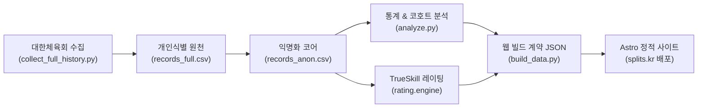

# splits ⛸️

> **대한민국 쇼트트랙 선수 이력 및 경기 데이터 분석 플랫폼**  
> 배포 사이트: **[splits.kr](https://splits.kr/)**

대한체육회의 공공 경기결과 데이터를 수집·정제하여, 유소년부터 국가대표에 이르기까지 **선수들의 성장 궤적과 대한민국 쇼트트랙의 통계적 역사**를 기록하고 시각화하는 오픈 데이터 프로젝트입니다.

---

## ✨ 핵심 기능 및 특징

- **⛸️ 선수 성장 이력 추적**: 공인 선수(`data/public_figures.csv`)의 초등 유년기부터 성인 무대까지의 전 경기 이력 시각화
- **📊 코호트 생존분석 & 통계**: 학년별 잔존율·이탈률, 초등 성적 구간별 중·고·대학 도달률, 향상도 기준선 제공
- **🏆 TrueSkill 베이지안 레이팅**: 4~6인 다자간 레이스 순위를 반영한 객관적 기량 지표 (1.8만 건 백테스트로 71.3% 승자 적중률 검증)
- **🔒 철저한 개인정보 보호**: $k$-익명성($k \ge 10$) 마스킹 및 SALT 기반 12자리 단방향 해시 익명키(`records_anon.csv`) 적용

---

## ⚡ 빠른 시작 (Quick Start)

복잡한 명령어 없이 **`make` 단축어**로 프로젝트를 즉시 구동할 수 있습니다.

```bash
# 1. 의존성 설치 (Python & Astro)
make setup

# 2. 통계 계산 및 정적 사이트 빌드
make build

# 3. 로컬 개발 서버 실행 (http://localhost:4321)
make dev
```

> 전체 사용 가능한 명령어 목록은 **`make help`**를 입력하여 확인할 수 있습니다.

---

## 🗺️ 전체 데이터 파이프라인



---

## 📚 상세 문서 허브 (Documentation)

프로젝트의 모든 아키텍처와 도메인 규칙은 `docs/` 디렉토리에 독립된 표준 문서로 관리됩니다.

| 문서                                                                | 설명                                                                    |
| :------------------------------------------------------------------ | :---------------------------------------------------------------------- |
| **[📖 데이터 사전 & 생태계 지도](docs/data_catalog.md)**            | 50여 개 데이터 파일의 7대 계층 분류, 컬럼 정의, 커밋/보안 정책          |
| **[🚀 파이프라인 운영 런북](docs/pipeline_runbook.md)**             | 주간 증분, 공인선수 추가, 분기 전수, 레이팅 등 6대 시나리오 실행 가이드 |
| **[📐 도메인 규칙 & 분석 알고리즘](docs/domain_rules.md)**          | 라운드(Final A/B) 판정, ID 통합 룰, 코호트 생존분석, TrueSkill 레이팅 수식 |
| **[🏗️ 모듈화 & 리팩토링 청사진](docs/architecture_refactoring.md)** | `analyze.py`를 `splits/` 패키지로 분리하는 점진적 아키텍처 로드맵       |
| **[📑 ADR (의사결정 기록)](docs/adr/)**                             | 레이팅 타당성, 백테스트 판정, 비교 추출 정책 등 아키텍처 의사결정 모음  |

---

## 🛠️ 기술 스택

- **Data Pipeline**: Python 3, Pandas, PyArrow (Parquet)
- **Web Frontend**: Astro, TypeScript, HTML5 / CSS3 / Vanilla JS
- **Rating Engine**: TrueSkill, Glicko-2, SciPy / NumPy
- **Automation & CI/CD**: GNU Make, GitHub Actions, Pytest (114 unit tests)
