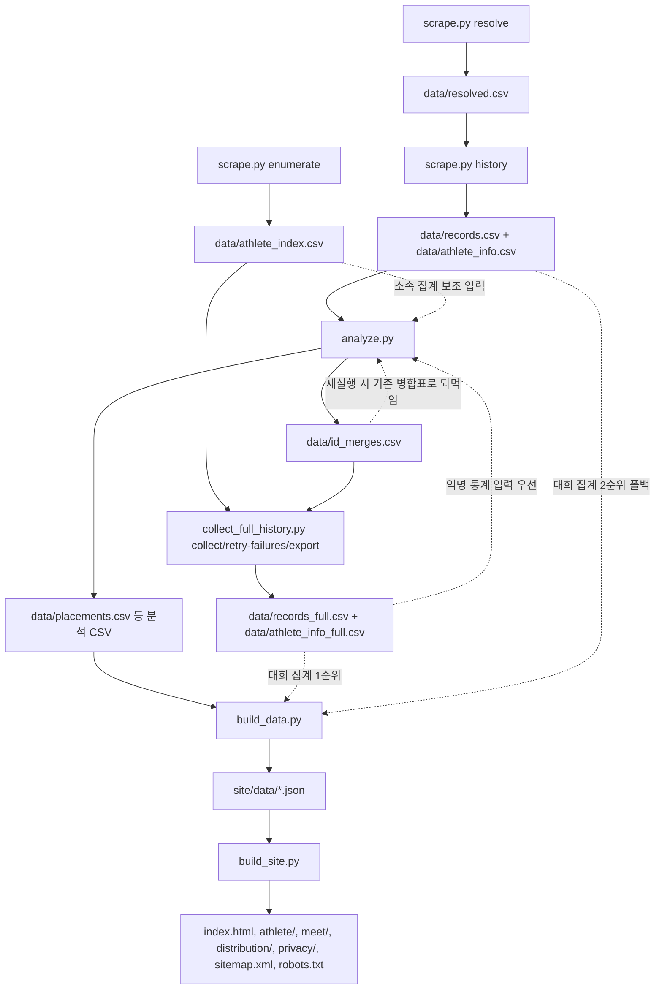

# splits

대한체육회 경기결과 데이터를 수집·정제해 쇼트트랙 선수 이력을 공개하는 프로젝트입니다.  
핵심은 **명령어별 산출물(CSV/JSON)과 다음 단계 의존 관계**를 명확히 유지하는 것입니다.

- 배포 URL: https://es-kimo.github.io/splits/
- 공개 대상 명단(수동 관리): `data/public_figures.csv`
- Python 파이프라인은 데이터 생성, Astro(`web/`)는 사이트 렌더링 담당

## 1) 위상정렬(선수 단계) 파이프라인



full 입력은 별도 종점이 아니라 `analyze.py`/`build_data.py`로 되돌아오는 되먹임 간선입니다.
`build_data.py`는 분석 CSV만으로는 동작하지 않고, `records_full`/`records` 중 한 쌍을 **반드시** 직접 읽습니다(둘 다 없으면 `FileNotFoundError`).

## 2) 빠른 실행(공개 사이트 빌드)

```bash
pip install -r requirements.txt
npm install --prefix web   # 최초 1회
python scrape.py resolve
python scrape.py history
python analyze.py
python build_data.py
python build_site.py
```

## 3) 커맨드별 입력/산출물/의존성

| 커맨드                                             | 선행 입력(주요)                                                                                                                                                                | 생성/갱신 산출물                                                                                                                                                                                                                                                                                                                                    | 다음 단계에서 사용                                          |
| -------------------------------------------------- | ------------------------------------------------------------------------------------------------------------------------------------------------------------------------------ | --------------------------------------------------------------------------------------------------------------------------------------------------------------------------------------------------------------------------------------------------------------------------------------------------------------------------------------------------- | ----------------------------------------------------------- |
| `python scrape.py resolve`                         | `athletes.py` 내 대상 명단                                                                                                                                                     | `data/candidates.csv`, `data/resolved.csv`                                                                                                                                                                                                                                                                                                          | `scrape.py history`                                         |
| `python scrape.py history`                         | `data/resolved.csv`                                                                                                                                                            | `data/records.csv`, `data/athlete_info.csv`, `data/raw/history_*.html`                                                                                                                                                                                                                                                                              | `analyze.py`                                                |
| `python scrape.py enumerate`                       | INF703 검색 결과                                                                                                                                                               | `data/athlete_index.csv`, `data/no_id_rows.csv`, `data/raw/search_*.html`                                                                                                                                                                                                                                                                           | `collect_full_history.py`                                   |
| `python analyze.py`                                | `data/records.csv`, `data/athlete_info.csv` (필수) / `data/athlete_index.csv`(선택, `SPLITS_ATHLETE_INDEX_CSV`로 경로 지정 가능), `data/id_merges.csv`(선택, 기존 병합표 재사용), `data/records_full.csv` + `data/athlete_info_full.csv`(선택, 익명 통계에만 우선 사용)                                                             | `data/clean_records.csv`, `data/placements.csv`, `data/youth_summary.csv`, `data/outliers.csv`, `data/coverage.csv`, `data/age_matrix.csv`, `data/best_heat_times.csv`, `data/school_raw_list.txt`, `data/school_aliases.csv`, `data/school_ambiguous.csv`, `data/id_merge_candidates.csv`, `data/id_merges.csv`, `data/stats_distribution.csv`, `data/stats_participation.csv` | `build_data.py`, `collect_full_history.py(간접: id_merges)` |
| `python collect_full_history.py collect`           | `data/athlete_index.csv` (`id_merges.csv` 있으면 치환 반영)                                                                                                                    | `data/raw/history/{idNo}.html`, `data/collect_progress.json`, `data/collect_failures.csv`, `data/records_full.csv`, `data/athlete_info_full.csv`                                                                                                                                                                                                    | `analyze.py` 익명 통계 입력 우선, `build_data.py` 대회 집계 입력 우선 |
| `python collect_full_history.py retry-failures`    | `data/collect_failures.csv`                                                                                                                                                    | 위 `collect`와 동일 파일 갱신                                                                                                                                                                                                                                                                                                                       | 동일                                                        |
| `python collect_full_history.py export`            | `data/raw/history/{idNo}.html`                                                                                                                                                 | `data/records_full.csv`, `data/athlete_info_full.csv` 재생성                                                                                                                                                                                                                                                                                        | 동일                                                        |
| `python collect_full_history.py compare-resolved`  | `data/resolved.csv`, `data/records.csv`, `data/athlete_info.csv`, `data/records_full.csv`, `data/athlete_info_full.csv`                                                        | CSV 생성 없음(회귀 비교 로그)                                                                                                                                                                                                                                                                                                                       | 품질 점검                                                   |
| `python collect_full_history.py cleanup-raw-cache` | `data/raw/history/*.html`                                                                                                                                                      | raw cache 삭제                                                                                                                                                                                                                                                                                                                                      | 저장 공간 정리                                              |
| `python build_data.py`                             | `data/placements.csv`, `data/youth_summary.csv`, `data/age_matrix.csv`, `data/athlete_info.csv`, `data/coverage.csv`, `data/public_figures.csv`, `data/stats_distribution.csv` + **대회 집계용 원천 1쌍 필수**: `records_full.csv`+`athlete_info_full.csv`(1순위) 또는 `records.csv`+`athlete_info.csv`(2순위) | `site/data/athletes.json`, `site/data/meets.json`, `site/data/distribution.json`, `site/data/meta.json`                                                                                                                                                                                                                                             | `build_site.py`                                             |
| `python build_site.py`                             | `site/data/*.json`, `web/`                                                                                                                                                     | 루트 정적 결과물(`index.html`, `athlete/`, `meet/`, `distribution/`, `privacy/`, `sitemap.xml`, `robots.txt`, `support.js`)                                                                                                                                                                                                                         | 배포                                                        |
| `python event_participants.py collect ...`         | 특정 대회 classCd/toCd 또는 event-index                                                                                                                                        | `data/event_{classCd}_{toCd}_participants.csv`, `data/event_{classCd}_{toCd}_participant_occurrences.csv`                                                                                                                                                                                                                                           | 대회 단위 점검/분석 보조                                    |

## 4) 전체 선수 기록 수집(비공개 원천 데이터) 운영

기본 공유 경로를 재사용할 때는 `--data-dir`로 외부 데이터 디렉터리를 지정합니다.

```bash
python collect_full_history.py --data-dir /Users/kihyun/orgs/personal/splits/data collect
python collect_full_history.py --data-dir /Users/kihyun/orgs/personal/splits/data retry-failures
python collect_full_history.py --data-dir /Users/kihyun/orgs/personal/splits/data compare-resolved
python collect_full_history.py --data-dir /Users/kihyun/orgs/personal/splits/data cleanup-raw-cache
```

- `collect`: 미수집 대상 이어받기 수집 + full CSV 생성
- `retry-failures`: 실패 목록만 재시도 + full CSV 재생성
- `compare-resolved`: 기존 resolved 기준 old/new 회귀 비교
- `cleanup-raw-cache`: 집계 후 raw HTML 캐시만 삭제
- `--data-dir` 미지정 시 `./data`(또는 `SPLITS_DATA_DIR`) 사용

## 5) 파일 의미(핵심)

| 파일                                                   | 의미                                                           |
| ------------------------------------------------------ | -------------------------------------------------------------- |
| `data/public_figures.csv`                              | 공개 대상 선수 목록(수동 관리, `상태=removed`는 빌드에서 제외) |
| `data/athlete_index.csv`                               | 전체 선수 수집용 id 인덱스                                     |
| `data/resolved.csv`                                    | 기준 선수 id 확정 결과                                         |
| `data/records.csv` / `data/athlete_info.csv`           | 기본 분석 입력(공개 사이트 핵심 입력)                          |
| `data/records_full.csv` / `data/athlete_info_full.csv` | 전체 수집 확장 입력(익명 통계 + 대회 집계 강화용)              |
| `data/id_merges.csv`                                   | 동일 선수 id 병합 확정표(부idNo→주idNo)                        |
| `data/placements.csv`                                  | 선수·대회·거리 단위 대표 성적(라운드 해석 적용 결과)           |
| `data/stats_distribution.csv`                          | 익명 분포 통계(k-익명성 기준 적용)                             |
| `data/stats_participation.csv`                         | 익명 참가 통계                                                 |
| `site/data/*.json`                                     | Astro 빌드 계약 데이터                                         |
| `index.html`, `athlete/`, `meet/` 등                   | 최종 배포 정적 산출물                                          |

## 6) 운영 원칙

- 대용량 원천 데이터(`records_full`, `athlete_info_full`, raw cache)는 기본적으로 Git에 커밋하지 않습니다.
- `python analyze.py`는 익명 통계 생성 시 `records_full/athlete_info_full`이 있으면 우선 사용하고, 없으면 `records/athlete_info`를 사용합니다. 선수 단계 산출물(`placements.csv` 등)은 항상 `records/athlete_info` 기준입니다.
- `python build_data.py`도 대회 집계에서 같은 우선순위(`records_full` → `records`)로 원천을 직접 읽습니다. 이 경로는 CSV를 거치지 않고 `analyze.py` 함수를 그대로 호출하므로 `Int64` 결측(`pd.NA`)이 살아 있습니다 — 값 변환 헬퍼는 `as_text()`를 거쳐 NA를 흡수해야 합니다.
- k-익명성 기준(`k=10`) 미만 구간은 행을 유지하되 `인원수`/지표를 `데이터 부족`으로 표기합니다.
