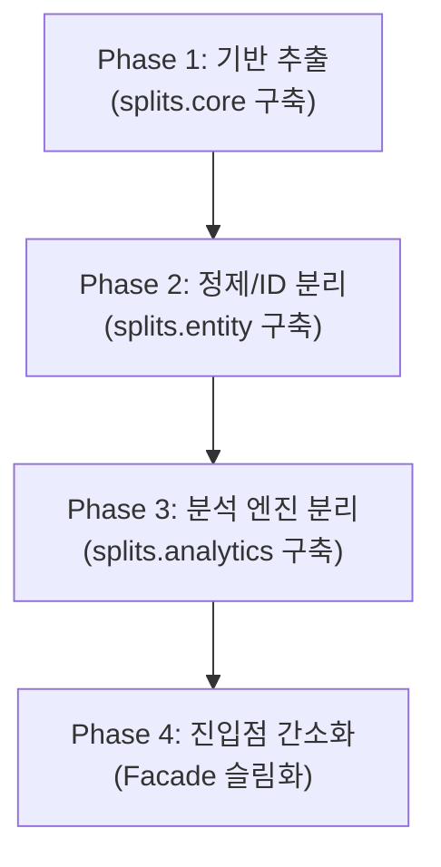

# splits 코드 모듈화 및 리팩토링 청사진 (Architecture Refactoring Blueprint)

> **문서 버전**: 1.0  
> **최종 갱신일**: 2026-08-29  
> **목적**: 4,500줄 모놀리스 스크립트를 기능별 독립 모듈로 안전하게 점진 분리하는 아키텍처 가이드

---

## 📌 목차
1. [현재 상태 분석 및 문제점 (As-Is Diagnosis)](#1-현재-상태-분석-및-문제점-as-is-diagnosis)
2. [목표 아키텍처 레이아웃 (To-Be Package Structure)](#2-목표-아키텍처-레이아웃-to-be-package-structure)
3. [도메인별 모듈 분리 명세](#3-도메인별-모듈-분리-명세)
   - [3.1 splits.core (공통 기반)](#31-splitscore-공통-기반)
   - [3.2 splits.crawler (수집 및 파싱)](#32-splitscrawler-수집-및-파싱)
   - [3.3 splits.entity (정제 및 ID 통합)](#33-splitsentity-정제-및-id-통합)
   - [3.4 splits.analytics (통계 및 코호트 엔진)](#34-splitsanalytics-통계-및-코호트-엔진)
   - [3.5 splits.site (데이터 직렬화 및 배포)](#35-splitssite-데이터-직렬화-및-배포)
4. [무중단 점진적 마이그레이션 4단계 로드맵](#4-무중단-점진적-마이그레이션-4단계-로드맵)
5. [품질 안전망 및 리팩토링 검증 규칙](#5-품질-안전망-및-리팩토링-검증-규칙)

---

## 1. 현재 상태 분석 및 문제점 (As-Is Diagnosis)

현재 `splits` 프로젝트는 단일 파일에 지나치게 많은 책임이 집중되어 있습니다.

```text
[현재 루트 구조]
├── analyze.py (4,529 lines / 218 KB)  <-- 학교 정규화, ID 병합, 라운드 판정, 코호트, 지속률, SVG 생성 등이 1개 파일에 혼재
├── collect_full_history.py (2,300+ lines) <-- HTTP 클라이언트, HTML 파서, 진행상태 큐, export 등이 혼재
├── event_participants.py (1,200+ lines)
├── build_data.py (1,100+ lines)
└── rating/ (모듈화 완료된 모범 패키지 구조)
```

### 주요 통증 포인트 (Pain Points)
1. **인지 부하(Cognitive Overload)**: `analyze.py`에서 특정 통계 로직 하나를 찾으려면 수천 줄을 스크롤해야 함.
2. **사이드 이펙트 공포**: 한 함수를 수정했을 때 다른 20여 종의 CSV 중 무엇이 영향을 받는지 추적하기 어려움.
3. **단위 테스트 어려움**: 순수한 계산 로직만 따로 떼어 테스트하기 어렵고, 전체 스크립트를 실행해야만 검증 가능.

---

## 2. 목표 아키텍처 레이아웃 (To-Be Package Structure)

기존의 실행 인터페이스(`python analyze.py`, `make build` 등)는 100% 호환되도록 유지하면서, 내부 코드를 도메인 역할에 따라 **`splits/` 파이썬 패키지**로 캡슐화합니다.

```text
splits/
├── __init__.py
│
├── core/                  # [기반 계층] 공통 상수, 시즌/학년 계산 헬퍼, 스키마
│   ├── __init__.py
│   ├── constants.py       # K_ANONYMITY_MIN, 컬럼명, 정규식 등
│   ├── dates.py           # 시즌 연도 계산, 학령 구간 역산
│   └── exceptions.py      # 커스텀 에러 클래스
│
├── crawler/               # [수집 계층] 대한체육회 스크래핑 & HTML 파싱
│   ├── __init__.py
│   ├── client.py          # HTTP Session, 딜레이(Gap), 재시도 로직
│   ├── progress.py        # collect_progress.json 추적 관리
│   └── parsers/           # HTML/JSON 응답 파서 분리
│       ├── inf201.py      # 대회 목록 파서
│       ├── inf301.py      # 종목/부별 파서
│       ├── inf310.py      # 경기 상세 결과 파서
│       └── inf503.py      # 선수 개인 이력 파서
│
├── entity/                # [정제 계층] 데이터 클리닝 & 선수 식별
│   ├── __init__.py
│   ├── cleaner.py         # 기록 이상치(Outlier) 탐지 및 일자 정규화
│   ├── schools.py         # 학교명/소속 정규화 (school_aliases 매핑)
│   └── resolver.py        # 동명이인 분리, ID 병합 매핑 (id_merges)
│
├── analytics/             # [분석 계층] 순수 비즈니스 & 통계 엔진
│   ├── __init__.py
│   ├── placements.py      # 라운드 대표 순위 산출 (Final A/B, SF 등)
│   ├── distribution.py    # 출생연도×성별×거리 백분위 & K-익명성
│   ├── cohort.py          # 좌측절단 보정 및 코호트 모수 정의
│   ├── retention.py       # 학년별 잔존율, 이탈률, Retention Band 교차표
│   ├── survival.py        # 공백 복귀율(Gap return) & 기록 중단 룰(Stop rule)
│   └── progression.py     # 향상도(Improvement) & 역추적(Reverse distribution)
│
├── rating/                # [레이팅 계층] (현재 구조 유지 - 이미 모듈화 완료)
│   ├── ledger/            # 경기 레저 Parquet 구축
│   ├── engine/            # Glicko-2 / TrueSkill 엔진
│   └── eval/              # 백테스트 및 검증
│
└── site/                  # [배포 계층] JSON 직렬화 & 웹 빌드
    ├── __init__.py
    ├── serializer.py      # site/data/*.json 변환 및 K-익명성 필터
    └── builder.py         # Astro 빌드 실행 및 정적 파일 동기화
```

---

## 3. 도메인별 모듈 분리 명세

### 3.1 `splits.core` (공통 기반)
- **`constants.py`**: `LOWER_BOUNDS`, `K_ANONYMITY_MIN`, `SEASON_START_MONTH`, 모든 CSV 헤더 튜플 정의.
- **`dates.py`**:
  - `infer_season_start_year(meet_year, normalized_date)`
  - `calculate_school_grade(season_start_year, birth_year)`
  - `resolve_school_level(category, birth_year, season_start_year)`

### 3.2 `splits.crawler` (수집 및 파싱)
- **책임 분리**: 네트워크 통신(`client.py`), 상태 기록(`progress.py`), 텍스트 파싱(`parsers/`)을 철저히 분리하여 HTML 구조 변경 시 파서만 수정하면 되도록 개선.

### 3.3 `splits.entity` (정제 및 ID 통합)
- **`schools.py`**: `normalize_school_key()`, `strip_region_prefix()`, `build_school_aliases_and_ambiguous()`
- **`resolver.py`**: `build_id_profiles()`, `evaluate_record_compatibility()`, `build_merge_map()`
- **`cleaner.py`**: `detect_outliers()`, `parse_time_to_seconds()`, `parse_rank()`

### 3.4 `splits.analytics` (통계 및 코호트 엔진)
- 각 분석 모듈은 **입력 DataFrame을 받아 계산 후 결과 DataFrame을 반환하는 순수 함수(Pure Function)** 형태로 구성.
- 파일 I/O와 계산 로직을 분리하여 초고속 단위 테스트가 가능해짐.

### 3.5 `splits.site` (데이터 직렬화 및 배포)
- `build_data.py`의 JSON 생성 로직과 `build_site.py`의 Astro 빌드 실행을 담당.

---

## 4. 무중단 점진적 마이그레이션 4단계 로드맵

시스템이 항상 정상 작동하는 상태를 유지하면서 안전하게 하나씩 옮기는 **Zero-Downtime 전략**을 따릅니다.



### Phase 1. 기반 모듈 추출 (`splits.core`)
1. `splits/core/constants.py` 및 `dates.py` 생성.
2. `analyze.py` 상단의 상수 및 날짜 계산 함수들을 `splits.core`에서 `import`하도록 변경.
3. **검증**: `make test` 및 `make build` 실행하여 기존 결과와 100% 일치 확인.

### Phase 2. 정제 및 ID 통합 모듈 추출 (`splits.entity`)
1. `splits/entity/schools.py`, `resolver.py`, `cleaner.py` 생성.
2. `analyze.py`에서 해당 함수들을 모듈 호출로 전환.
3. **검증**: `make audit` 및 `make build` 실행하여 `data/clean_records.csv` 동일성 검증.

### Phase 3. 분석 및 코호트 엔진 분리 (`splits.analytics`)
1. `retention.py`, `cohort.py`, `distribution.py` 등으로 통계 함수들을 분할 이전.
2. 각 함수별 전용 단위 테스트(`tests/test_retention.py` 등) 작성.
3. **검증**: 20여 종의 분석 CSV 산출물 hash 비교.

### Phase 4. 메인 진입점 파사드(Facade) 슬림화
1. 기존 루트의 `analyze.py`는 단 50줄 내외의 오케스트레이터(각 모듈을 순차 호출하는 스크립트)로 변환.
2. 사용자 및 `Makefile` 인터페이스는 완벽히 보존.

---

## 5. 품질 안전망 및 리팩토링 검증 규칙

리팩토링 도중 발생할 수 있는 데이터 왜곡을 원천 차단하기 위해 다음 3단계 검증을 각 Phase마다 수행합니다.

1. **단위 테스트 게이트**:
   ```bash
   make test   # 114개 기존 테스트 전체 PASS 필수
   ```
2. **데이터 회귀 점검 (Data Diff Verification)**:
   - 리팩토링 전 생성된 `data/*.csv`와 리팩토링 후 생성된 `data/*.csv`를 `git diff`로 비교하여 수치 변화가 0건임을 확인.
3. **커밋 및 무결성 감사**:
   ```bash
   make audit  # 개인정보 누출 방지 및 ID 신뢰도 재검증
   ```
