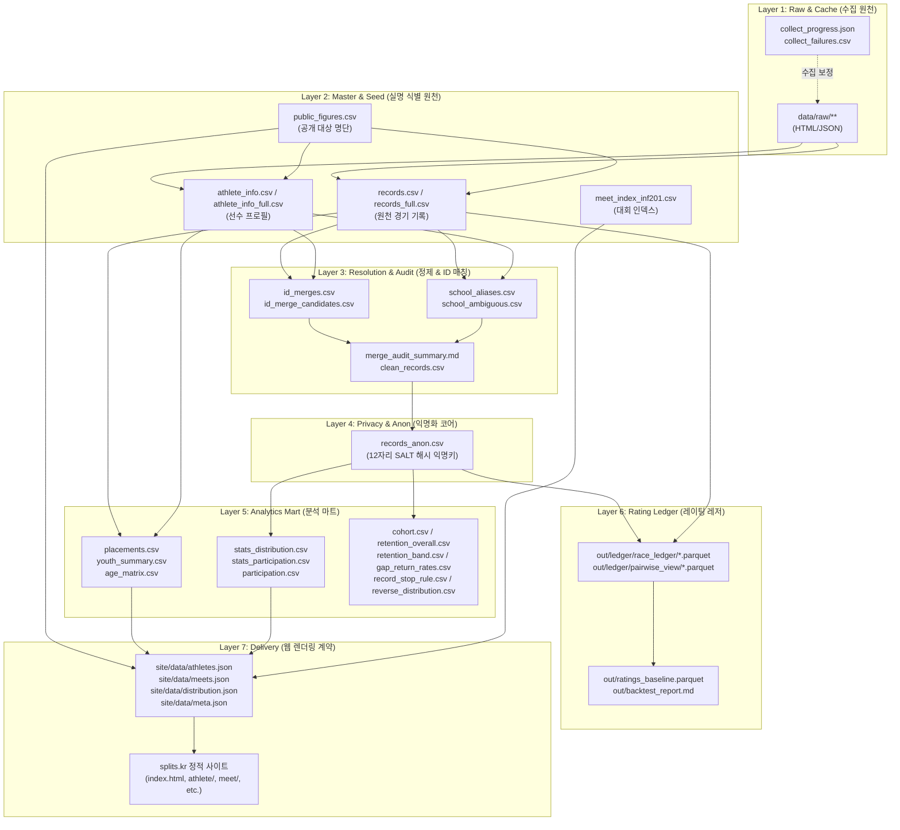
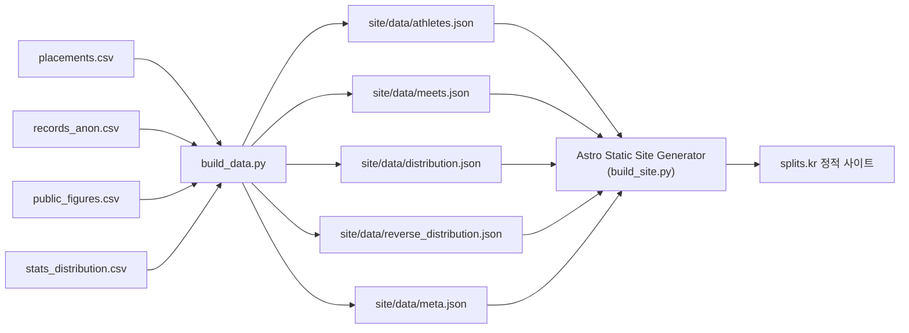

# splits 데이터 카탈로그 및 생태계 지도 (Data Catalog & Lineage)

> **문서 버전**: 1.0  
> **최종 갱신일**: 2026-08-29  
> **관리 대상**: `splits` 프로젝트 내 모든 원천 데이터, 가공 마트, 익명화 데이터, 레이팅 레저, 배포 JSON

---

## 📌 목차

1. [전체 데이터 아키텍처 및 계층 다이어그램](#1-전체-데이터-아키텍처-및-계층-다이어그램)
2. [데이터 라이프사이클 7대 계층 요약](#2-데이터-라이프사이클-7대-계층-요약)
3. [계층별 상세 데이터 사전 (Data Dictionary)](#3-계층별-상세-데이터-사전-data-dictionary)
   - [Layer 1. Raw & Crawl Logs (수집 원천 및 캐시)](#layer-1-raw--crawl-logs-수집-원천-및-캐시)
   - [Layer 2. Master & Seed (선수 식별/마스터 데이터)](#layer-2-master--seed-선수-식별마스터-데이터)
   - [Layer 3. Entity Resolution & Quality Audit (개체 식별/정제/감사)](#layer-3-entity-resolution--quality-audit-개체-식별정제감사)
   - [Layer 4. Privacy & Anonymized Core (익명화 코어)](#layer-4-privacy--anonymized-core-익명화-코어)
   - [Layer 5. Analytics Mart (통계 및 코호트 마트 - 20여 종)](#layer-5-analytics-mart-통계-및-코호트-마트---20여-종)
   - [Layer 6. Rating & Ledger (레이팅 레저 및 평가)](#layer-6-rating--ledger-레이팅-레저-및-평가)
   - [Layer 7. Delivery Contract (웹 렌더링 JSON)](#layer-7-delivery-contract-웹-렌더링-json)
4. [보안 및 Git 커밋 정책 (Privacy & Security)](#4-보안-및-git-커밋-정책-privacy--security)
5. [데이터 계보 및 흐름 요약표 (Data Lineage Matrix)](#5-데이터-계보-및-흐름-요약표-data-lineage-matrix)

---

## 1. 전체 데이터 아키텍처 및 계층 다이어그램



---

## 2. 데이터 라이프사이클 7대 계층 요약

| 계층 번호   | 계층명                 | 주요 역할                                                        | 보존 형태       | 커밋 허용                                               |
| :---------- | :--------------------- | :--------------------------------------------------------------- | :-------------- | :------------------------------------------------------ |
| **Layer 1** | **Raw & Logs**         | 대한체육회 API/웹 원본 응답 캐시 및 수집 상태 로그               | HTML, JSON, CSV | ❌ 커밋 금지                                            |
| **Layer 2** | **Master & Seed**      | 실명, 생년월일, 소속, idNo가 포함된 비공개 원천 데이터           | CSV             | ⚠️ `public_figures.csv`, `meet_index_inf201.csv`만 허용 |
| **Layer 3** | **Resolution & Audit** | 동명이인 분리, 소속 정규화, 동일인 ID 병합 및 무결성 감사        | CSV, TXT, MD    | ⚠️ 정규화 규칙만 허용, 개인 식별 샘플 금지              |
| **Layer 4** | **Privacy & Anon**     | 개인 식별값을 영구 제거하고 SALT 해시 익명키를 부여한 공개 원천  | CSV             | ✅ **커밋 허용** (핵심 저장소)                          |
| **Layer 5** | **Analytics Mart**     | 코호트 생존분석, 지속률, 백분위 분포, 라운드 성적 요약 (20여 종) | CSV             | ✅ **커밋 허용** (k-익명성 충족)                        |
| **Layer 6** | **Rating & Ledger**    | 1:1 대결 Pairwise 추출, Glicko-2 레이팅 계산 및 백테스트 레저    | Parquet, MD     | ❌ Parquet은 `out/` 생성 (필요시 리포트만)              |
| **Layer 7** | **Delivery Contract**  | Astro 프론트엔드가 직접 읽어 HTML/SVG로 렌더링하는 계약 JSON     | JSON            | ❌ 빌드 산출물 (`site/data/`)                           |

---

## 3. 계층별 상세 데이터 사전 (Data Dictionary)

---

### Layer 1. Raw & Crawl Logs (수집 원천 및 캐시)

외부 서버 부하를 최소화하고 결정론적(Deterministic) 재현성을 보장하기 위한 수집 캐시입니다.

| 파일/경로                                    | 생성 스크립트             | 설명 및 주요 컬럼                                                 |
| :------------------------------------------- | :------------------------ | :---------------------------------------------------------------- |
| `data/raw/inf201/{page}.html`                | `collect_full_history.py` | 쇼트트랙 대회 목록(INF201) 페이지별 HTML 응답 원본                |
| `data/raw/inf301_kind/{classCd}_{toCd}.html` | `collect_full_history.py` | 특정 대회의 종목/부별 목록(INF301) 응답                           |
| `data/raw/detail_class_ajax/{key}.json`      | `collect_full_history.py` | 세부종목 AJAX 응답 JSON                                           |
| `data/raw/inf310/{key}.html`                 | `collect_full_history.py` | 특정 경기(조/라운드) 상세 결과 HTML (레인, 기록, 순위, 선수 링크) |
| `data/raw/inf503/{idNo}.html`                | `collect_full_history.py` | 선수 개인 이력 카드 HTML (생년월일, 소속 변천, 전체 대회 기록)    |
| `data/collect_progress.json`                 | `collect_full_history.py` | 대회별 수집 상태 (`done`, `partial`, `failed`, 타임스탬프)        |
| `data/collect_failures.csv`                  | `collect_full_history.py` | 수집 실패/부분완료 대회 목록 (`toCd, classCd, error_type`)        |
| `data/detail_failures.csv`                   | `collect_full_history.py` | 세부 경기 단위 수집 실패 로그                                     |
| `data/collect_request_failures.csv`          | `collect_full_history.py` | 네트워크 HTTP 타임아웃/에러 추적 로그                             |
| `data/suspicious_ids.csv`                    | `collect_full_history.py` | 비정규 `idNo` 감지 로그 (예: `201104T00845` 등 임시 번호)         |
| `data/weekly_incremental_summary.json`       | `collect_full_history.py` | 주간 증분 실행 결과 요약 (신규 대회 수, 추가된 경기 수)           |

---

### Layer 2. Master & Seed (선수 식별/마스터 데이터)

실제 사람과 매칭되는 가장 기초적인 원천 데이터셋입니다.

#### 1) `data/public_figures.csv` (수동 관리 / 커밋 허용)

- **목적**: `splits.kr` 웹사이트에 실명과 경기 이력을 공개할 공인 선수 명단.
- **스키마**:
  - `idNo`: 체육회 12자리 선수 고유번호 (Primary Key)
  - `이름`: 선수 실명
  - `슬러그`: URL 친화적 영문 식별자 (예: `choi-minjeong`)
  - `출생연도`: 4자리 연도
  - `지정근거`: 국가대표 등재, 언론 보도 등 공인 지정 근거 문구
  - `언론보도URL`: 공인 입증 링크
  - `지정일자`: YYYY-MM-DD
  - `상태`: `active` (공개) / `removed` (제외)

#### 2) `data/records.csv` & `data/records_full.csv` (비공개)

- **목적**: 대한체육회에서 파싱된 모든 개별 경기 출전 기록 (`records`는 공인선수 한정, `records_full`은 전수 수집본).
- **스키마**:
  - `idNo`: 선수 고유 식별자
  - `대회명`: 대회 전체 명칭
  - `일자_정규화`: YYYY-MM-DD
  - `종별`: 초등부, 중학부, 고등부, 대학부, 일반부 등
  - `세부종목`: 500M, 1000M, 1500M, 3000M 등
  - `라운드`: 예선1조, 준결승1조, 결승 등
  - `소속`: 출전 당시 소속팀/학교
  - `기록`: `MM:SS.mmm` 또는 `SS.mmm`
  - `순위`: 해당 조 내 순위
  - `classCd, toCd, kindCd, detailClassCd`: 체육회 내부 코드 체계

#### 3) `data/athlete_info.csv` & `data/athlete_info_full.csv` (비공개)

- **목적**: 선수 개인별 프로필 마스터.
- **스키마**: `idNo, 이름, 출생연도, 성별, 최초출전연도, 최종출전연도, 총출전수`

#### 4) `data/meet_index_inf201.csv` (커밋 허용)

- **목적**: 대회 코드(`toCd`)와 대회명, 개최일자, 연도 간 매핑 인덱스 (주간 증분 신규 판별 기준).

---

### Layer 3. Entity Resolution & Quality Audit (개체 식별/정제/감사)

동명이인 분리 및 이중 등록된 선수 ID를 하나로 통합하고 정합성을 감사하는 데이터셋입니다.

| 파일명                         | 생성/관리                     | 핵심 목적 및 설명                                                                                    |
| :----------------------------- | :---------------------------- | :--------------------------------------------------------------------------------------------------- |
| `data/resolved.csv`            | `scrape.py resolve`           | 명단 검색 결과 매칭 확정된 선수 ID 및 소속 목록                                                      |
| `data/id_merge_candidates.csv` | `analyze.py`                  | 동일인으로 의심되는 ID 쌍 추천 목록 (이름+생년+소속 변천 일치도 기반)                                |
| `data/id_merges.csv`           | 수동 확정                     | 확정된 ID 병합 매핑표 (`부idNo -> 주idNo`). `analyze.py` 실행 시 자동 반영                           |
| `data/clean_records.csv`       | `analyze.py`                  | ID 병합 및 일자/기록 포맷 정규화가 완료된 내부 작업용 데이터셋                                       |
| `data/school_aliases.csv`      | `analyze.py`                  | 소속 학교/실업팀 원본 표기와 정규화 명칭 매핑 (예: `성남시청 -> 성남시청`, `서현고 -> 서현고등학교`) |
| `data/school_ambiguous.csv`    | `analyze.py`                  | 지역명이 빠져 모호한 학교명 검토 목록 (예: `삼육초등학교 -> 대구/부산 검토`)                         |
| `data/merge_audit_summary.md`  | `audit_id_key_reliability.py` | ID 병합 신뢰도, 분리 리스크 및 과통합 리스크 정량 감사 보고서                                        |

---

### Layer 4. Privacy & Anonymized Core (익명화 코어)

#### `data/records_anon.csv` (핵심 저장소 / 커밋 허용)

- **역할**: 개인식별정보(`이름`, `idNo`, `소속`, `시도`, `BIB`, `레인`)를 완전히 배제하고, `SPLITS_ANON_SALT` 기반 SHA-256 해시의 앞 12자리로 치환한 공개용 원천 데이터.
- **헤더 순서 (고정)**:
  `toCd, classCd, 대회명, 대회연도, 일자, 종별, 학령구간, 거리, SF여부, 라운드, 라운드종류, 순위, 기록_초, 사유, 성별, 출생연도, 학년, 익명키`
- **주요 파생 필드**:
  - `classCd`: 1=스피드스케이팅, 2=쇼트트랙, 3=피겨 (규칙 기반 자동 판별)
  - `기록_초`: 부동소수점 초 단위 (예: `45.123`)
  - `익명키`: 12자리 16진수 해시 문자열 (동일인은 salt가 같으면 동일 익명키 유지)

---

### Layer 5. Analytics Mart (통계 및 코호트 마트 - 20여 종)

`analyze.py`가 생성하며, 웹사이트 시각화 및 학술적/도메인 통계 지표의 원천입니다.

#### A. 선수 및 경기 성적 요약군

- `data/placements.csv`: 선수·대회·거리 단위 대표 성적 (예선 탈락, 준결승(SF), 결승 A/B 순위 해석 적용).
- `data/youth_summary.csv`: 유년기(초등~고등) 최고/최저 순위, 출전수, 6학년 추정연도, 유년기 데이터 신뢰도 등급 (`high`/`medium`/`low`).
- `data/age_matrix.csv`: 선수별 7세부터 18세까지의 연령대별 최고 순위 매트릭스.
- `data/best_heat_times.csv`: 조별/라운드별 최고 기록 집계.
- `data/outliers.csv`: 비정상 기록(센서 오작동, 표기 오류 등) 필터링된 이상치 목록.
- `data/coverage.csv`: 연도별 수집 완료율 및 선수 커버리지 요약.

#### B. 익명 분포 및 참여 통계군

- `data/stats_distribution.csv`: `출생연도 × 성별 × 거리` 단위 기록 백분위 ($p_{05}, p_{10}, \dots, p_{95}$) 및 순위 백분위 ($k \ge 10$ 익명성 미달 시 '데이터 부족' 마스킹).
- `data/stats_participation.csv`: 출생연도/성별별 최초 출전 나이 및 초등부 출전수 분포.
- `data/participation.csv`: 선수 × 시즌별 활동 이력 (`익명키, 시즌, 학년, 단계, 종목코드, 오픈참가여부`).
- `data/season_activity_counts.csv`: 시즌별 활동 선수 총수 추이.
- `data/season_month_histogram.csv`: 월별 대회 개최 분포 (7월~익년 6월 시즌 경계 설정 근거).

#### C. 코호트 생존분석 및 지속률/이탈률군

- `data/cohort.csv`: 선수별 코호트 분석 플래그 (좌측절단 Left-truncation 여부, 초/중/고/대/국가대표 분석 대상 포함 여부).
- `data/cohort_stage_summary.csv`: 단계별 분석 대상 모수(N), 성별 분포 및 표본 신뢰 한계.
- `data/retention_overall.csv`: 학년별 잔존율, 신규 진입률, 학년 이탈률, 상위 단계 도달률 및 95% 신뢰구간(CI).
- `data/retention_band.csv`: 초등 5~6학년 성적 구간(상위 10%, 10~30%, 30~50% 등)에 따른 중·고·대학 도달률 교차 분석표.
- `data/improvement_rate.csv`: 학년·성별·거리별 기록 향상 속도(초/년) 기준선 및 예측력 검증 데이터.
- `data/reverse_distribution.csv`: 최종 도달 단계(대학/실업, 국가대표) 선수들의 초등 유년기 백분위 역추적 분포.
- `data/class_transition_summary.csv`: 시즌별 종목 전환(쇼트트랙 ↔ 스피드) 및 이탈 유형 집계.
- `data/gap_return_rates.csv`: 1시즌~4+시즌 미출전 공백 후 복귀율 분석표.
- `data/record_stop_rule.csv`: "n시즌 연속 미출전 시 이탈(기록 중단)로 확정한다"는 통계적 임계치 및 근거 문장.

#### D. 종목 및 등급 매핑군

- `data/class_level_map.csv`, `data/class_level_year_category_counts.csv`, `data/class_level_ab_agreement_summary.csv`, `data/class_level_year_readiness.csv`: 종별(초등/중등/고등) 및 급수 체계 매핑/검증 데이터.

---

### Layer 6. Rating & Ledger (레이팅 레저 및 평가)

선수 간 상대적 기량을 측정하는 TrueSkill / Glicko-2 레이팅 파이프라인의 Parquet 레저와 감사 리포트입니다. (ADR 0006 최적 채택: TrueSkill)

| 산출물 경로                                      | 포맷     | 설명                                                                                              |
| :----------------------------------------------- | :------- | :------------------------------------------------------------------------------------------------ |
| `out/ledger/race_ledger/season=YYYY/*.parquet`   | Parquet  | 경기 단위 정제 결과 및 선수별 레이스 메타데이터                                                   |
| `out/ledger/pairwise_view/season=YYYY/*.parquet` | Parquet  | 동일 조/경기 내 선수 간 1:1 대결(Win/Loss/Draw) 확장 뷰                                           |
| `out/ledger/ranking_view/season=YYYY/*.parquet`  | Parquet  | 대회-종목-라운드 단위 순위 집계 뷰                                                                |
| `out/ratings_baseline.parquet`                   | Parquet  | TrueSkill/Glicko-2 엔진 실행 결과 산출된 선수별 최종 레이팅 스냅샷                                |
| `out/replay_checkpoints/*.parquet`               | Parquet  | 입력·파라미터·알고리즘 버전에 묶인 시즌 경계 원시 레이팅 상태 (생성물, 커밋 제외)                 |
| `out/replay_bench.md`                            | Markdown | 전체/마지막 시즌 재생 시간, 최대 메모리, 시즌별 시간, 프로파일 측정값                            |
| `out/calibrator.json`                            | JSON     | Platt 보정기 계수와 적합 폴드/표본 수 메타데이터                                                  |
| `out/rating_run.json`                            | JSON     | 결정적 `run_id`, `calibrator_json`, 입력 레저 digest, 보정 전/후 확률 digest를 담은 실행 manifest |
| `out/calibration_report.md`                      | Markdown | 보정기 프로토콜(적합 폴드, 재적합 주기, 세그먼트 분리) 판정 리포트                                |
| `out/connectivity_report.md`                     | Markdown | 선수 간 대결 그래프의 연결성(Connectivity) 및 거대 성분 검증 리포트                               |
| `out/status_audit.md`                            | Markdown | 실격(DQ), 부전승(ADV), 미출전(DNS) 등 원천 상태 코드 감사표                                       |
| `out/backtest_report.md`                         | Markdown | 12개 설정 전수 백테스트 결과 리포트 (TrueSkill 71.3% 승자 적중률 검증)                            |

---

### Layer 7. Delivery Contract (웹 렌더링 JSON)

`build_data.py`가 생성하여 Astro 프론트엔드(`web/`)에 제공하는 최종 데이터 계약입니다.



| 파일명                                | 주요 포함 내용                                                                                |
| :------------------------------------ | :-------------------------------------------------------------------------------------------- |
| `site/data/athletes.json`             | 공개 선수 목록, 나이별(7~18세) 순위, 유년기 통계, 전체 경기 이력 리스트                       |
| `site/data/meets.json`                | 대회별 메타(일자, 장소, 시리즈 연결), 종별 참가자수, 거리별 기록 분포(P10~P90), 공인선수 성적 |
| `site/data/distribution.json`         | 출생연도/성별/거리별 기록 분포 (Astro 차트/분포 시각화용)                                     |
| `site/data/reverse_distribution.json` | 최종 진입군별 유년기 성적 분포                                                                |
| `site/data/meta.json`                 | 전체 빌드 일시, 데이터 기준일, 선수/대회 수 총계 메타데이터                                   |

---

## 4. 보안 및 Git 커밋 정책 (Privacy & Security)

대한체육회 데이터에는 미성년자 및 일반 선수의 개인정보가 포함되어 있으므로 엄격한 3단계 커밋 정책을 유지합니다.

```text
[커밋 절대 금지 ❌]
- 개인식별 원천: records.csv, records_full.csv, athlete_info.csv, athlete_info_full.csv, athlete_index.csv
- 원천 HTML/JSON: data/raw/**
- ID 매칭/임시: candidates.csv, id_merge_candidates.csv, id_merges.csv
- 환경변수: .env, .env.local (SPLITS_ANON_SALT 포함 파일)

[조건부 검토 후 커밋 ⚠️]
- 공인선수 목록: public_figures.csv (사전 동의 및 공인 기준 충족자 한정)
- 대회 인덱스: meet_index_inf201.csv (개인정보 없음)
- 소속 정규화: school_aliases.csv

[커밋 적극 권장 ✅]
- 익명 원천: records_anon.csv (SALT 해시 키 사용, 개인정보 컬럼 배제)
- 통계/코호트 마트: stats_distribution.csv, cohort.csv, retention_*.csv 등 (k-익명성 >= 10 충족)
```

---

## 5. 데이터 계보 및 흐름 요약표 (Data Lineage Matrix)

| 데이터 산출물                                | 선행 입력 (Inputs)                                                                   | 생성 커맨드 / 스크립트                                | 주 소비처 (Consumers)                    |
| :------------------------------------------- | :----------------------------------------------------------------------------------- | :---------------------------------------------------- | :--------------------------------------- |
| `data/raw/**`                                | 대한체육회 웹서버                                                                    | `python collect_full_history.py collect`              | `collect_full_history.py export`         |
| `data/records_full.csv`                      | `data/raw/**` 캐시                                                                   | `python collect_full_history.py export`               | `analyze.py`, `build_data.py`            |
| `data/resolved.csv`                          | `athletes.py` 대상 명단                                                              | `python scrape.py resolve`                            | `scrape.py history`                      |
| `data/records.csv`                           | `data/resolved.csv`                                                                  | `python scrape.py history`                            | `analyze.py`, `build_data.py`            |
| `data/id_merges.csv`                         | `id_merge_candidates.csv` (수동 확정)                                                | 수동 매핑 작업                                        | `analyze.py`                             |
| `data/records_anon.csv`                      | `records_full.csv` (또는 `records.csv`) + `SPLITS_ANON_SALT`                         | `python build_data.py` 또는 `collect_full_history.py` | `analyze.py`, Git 저장소, 레이팅         |
| `data/placements.csv`                        | `records.csv`, `athlete_info.csv`                                                    | `python analyze.py`                                   | `build_data.py`                          |
| `data/cohort.csv` 외 20종 통계               | `records_full.csv` (폴백: `records_anon.csv`)                                        | `python analyze.py`                                   | `build_data.py`, 연구 분석               |
| `out/ledger/*.parquet`                       | `records_anon.csv` 또는 `records_full.csv`                                           | `python -m rating.ledger.build`                       | `rating.engine.runner`                   |
| `out/ratings_baseline.parquet`               | `out/ledger/race_ledger`                                                             | `python -m rating.engine.runner`                      | `rating.eval.backtest`                   |
| `out/replay_checkpoints/*.parquet`           | `out/ledger/race_ledger`                                                             | `python -m rating.replay.orchestrator`                | 부분 리플레이                             |
| `out/replay_bench.md`                        | `out/ledger/race_ledger`                                                             | `python -m rating.replay.orchestrator --bench`        | `docs/adr/0010-replay-strategy.md`       |
| `out/calibrator.json`, `out/rating_run.json` | `out/ledger/race_ledger`                                                             | `python -m rating.engine.runner`                      | R-09 실행 레지스트리, 백테스트/회귀 재현 |
| `out/calibration_report.md`                  | `out/ledger/race_ledger`, `out/calibrator.json`                                      | `python -m rating.calibration.protocol`               | `docs/adr/0008-calibration.md`           |
| `site/data/*.json`                           | `placements.csv`, `records_anon.csv`, `public_figures.csv`, `stats_distribution.csv` | `python build_data.py`                                | `build_site.py` (Astro)                  |
| `index.html` 등 배포물                       | `site/data/*.json`, `web/` 템플릿                                                    | `python build_site.py`                                | `splits.kr` 웹 서빙                      |
