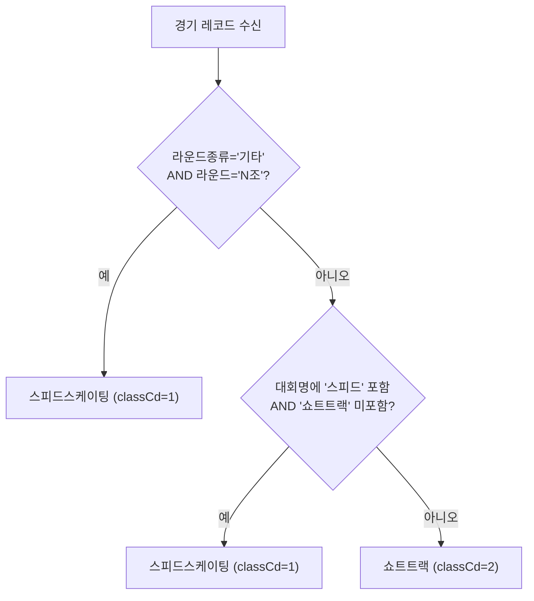
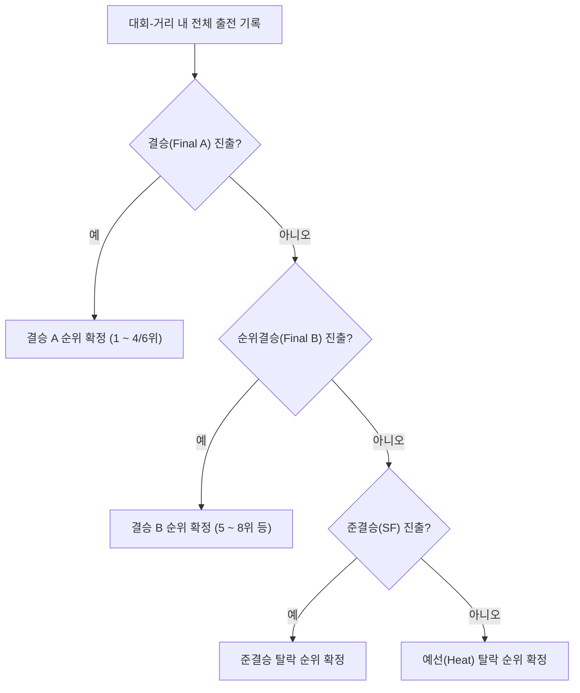

# splits 도메인 규칙 및 통계 알고리즘 명세서 (Domain & Analytics Specs)

> **문서 버전**: 1.0  
> **최종 갱신일**: 2026-08-29  
> **관련 모듈**: `analyze.py`, `rating/`, `collect_full_history.py`

---

## 📌 목차
1. [빙상 경기 및 메타 도메인 규칙](#1-빙상-경기-및-메타-도메인-규칙)
   - [1.1 종목 판별 규칙 (classCd)](#11-종목-판별-규칙-classcd)
   - [1.2 시즌 경계 (Season Boundary)](#12-시즌-경계-season-boundary)
   - [1.3 학령 구간 및 학년 역산 공식](#13-학령-구간-및-학년-역산-공식)
2. [경기 라운드 및 대표 성적 산출 로직 (Placement Logic)](#2-경기-라운드-및-대표-성적-산출-로직-placement-logic)
   - [2.1 라운드 위계 및 대표 순위 확정](#21-라운드-위계-및-대표-순위-확정)
   - [2.2 특수 판정 및 실격(DQ/PEN/ADV) 처리](#22-특수-판정-및-실격dqpenadv-처리)
3. [선수 식별 및 ID 통합 룰 (Entity Resolution)](#3-선수-식별-및-id-통합-룰-entity-resolution)
   - [4대 매칭 신호 및 휴리스틱](#4대-매칭-신호-및-휴리스틱)
   - [ID 병합 되먹임 루프](#id-병합-되먹임-루프)
4. [통계 분석 및 K-익명성 모델](#4-통계-분석-및-k-익명성-모델)
   - [4.1 K-익명성 (k >= 10) 및 마스킹](#41-k-익명성-k--10-및-마스킹)
   - [4.2 백분위 (Quantiles) 산출](#42-백분위-quantiles-산출)
5. [코호트 생존분석 및 지속률/이탈률 모델](#5-코호트-생존분석-및-지속률이탈률-모델)
   - [5.1 좌측 절단(Left-truncation) 보정](#51-좌측-절단left-truncation-보정)
   - [5.2 기록 중단(Stop Rule) 판정 기준](#52-기록-중단stop-rule-판정-기준)
   - [5.3 학년별 잔존율(Retention) 및 이탈률 산출](#53-학년별-잔존율retention-및-이탈률-산출)
   - [5.4 초등 성적 구간별 도달률 (Retention Band)](#54-초등-성적-구간별-도달률-retention-band)
   - [5.5 엘리트 역추적 분포 (Reverse Distribution)](#55-엘리트-역추적-분포-reverse-distribution)
6. [Glicko-2 레이팅 시스템 사양](#6-glicko-2-레이팅-시스템-사양)

---

## 1. 빙상 경기 및 메타 도메인 규칙

### 1.1 종목 판별 규칙 (classCd)
대한체육회 전산망(INF201)은 조회 시 모든 응답에 쇼트트랙 코드(`classCd=2`)를 일괄 반환하는 한계가 있어, 실제 기록의 형태와 대회명을 기반으로 종목을 자동 판별합니다.



- **코드 규격**:
  - `1`: 스피드스케이팅 (Long track speed skating)
  - `2`: 쇼트트랙 스피드스케이팅 (Short track speed skating)
  - `3`: 피겨스케이팅 (Figure skating)
- **보존 원칙**: 스피드스케이팅 기록도 데이터셋에서 삭제하지 않고 보존하며, 쇼트트랙 분석(`analyze.py`) 시에는 `classCd=2` 조건으로 필터링합니다.

---

### 1.2 시즌 경계 (Season Boundary)
빙상 종목은 하계 종목과 달리 가을에 개막하여 이듬해 봄에 종료됩니다.

```text
[시즌 정의]
당해 연도 7월 1일 ~ 익년 6월 30일 = 1개 시즌
예: 2024년 10월 대회 & 2025년 2월 대회 -> 모두 "2024 시즌"
```

- **판정 근거 (`season_month_histogram.csv`)**:
  - 7~9월: 시즌 준비 및 개막전 시작 (3.2%)
  - 10~12월: 회장배, 학생선수권 등 전반기 대회 (42.1%)
  - 1~3월: 동계체전, 종합선수권 등 피크 구간 (48.5%)
  - 4~6월: 비시즌 / 휴식기 (6.2%)
- **수식**:
  $$\text{SeasonStartYear} = \begin{cases} \text{Year}, & \text{if Month} \ge 7 \\ \text{Year} - 1, & \text{if Month} \le 6 \end{cases}$$

---

### 1.3 학령 구간 및 학년 역산 공식
선수의 출생연도와 시즌 연도를 바탕으로 표준 학령을 자동 산출합니다.

$$\text{Grade} = \text{SeasonStartYear} - \text{BirthYear} - 6$$

| Grade 값 | 연령(만 나이) | 학령 단계 | 비고 |
| :---: | :---: | :---: | :--- |
| $1 \sim 6$ | 만 7 ~ 12세 | **초등** (초1 ~ 초6) | 5~6학년은 전문선수 진입 핵심기 |
| $7 \sim 9$ | 만 13 ~ 15세 | **중등** (중1 ~ 중3) | 1차 이탈/진학 갈림길 |
| $10 \sim 12$ | 만 16 ~ 18세 | **고등** (고1 ~ 고3) | 2차 엘리트 선별기 |
| $13+$ | 만 19세 이상 | **대학·일반** | 실업팀 및 프로 진입군 |

- **부별 표기 불일치 해소**: 대회 출전 부별(`종별`: 초등부/중학부 등)과 계산된 학년이 충돌할 경우, 출생연도 기반 학년을 1순위로 채택하고 동호인/클럽부 출전은 `오픈참가` 플래그로 분리합니다.

---

## 2. 경기 라운드 및 대표 성적 산출 로직 (Placement Logic)

동일 대회, 동일 거리에서 선수는 예선부터 결승까지 여러 차례 경기를 치릅니다. `analyze.py`는 이를 종합하여 **선수의 해당 종목 대표 성적(Placement)**을 결정론적으로 확정합니다.

### 2.1 라운드 위계 및 대표 순위 확정



1. **결승 (Final / Final A)**: 라운드명에 `결승`, `Final`, `Final A` 표기. 우승~메달권 순위.
2. **순위결승 (Final B)**: 라운드명에 `Final B`, `순위결승` 표기. 메달권 외 5~8위권 결정전.
3. **준결승 (Semi-Final / SF)**: 라운드명에 `준결승`, `Semi` 표기.
4. **예선 (Heat / Quarter)**: `예선1조`, `준준결승` 등.

### 2.2 특수 판정 및 실격(DQ/PEN/ADV) 처리
- **DQ / PEN (실격/페널티)**: 순위는 최하위 또는 실격으로 처리하되, 진출 라운드 도달 사실은 기록.
- **ADV (어드밴스 / 판정 진출)**: 경기 중 상대 선수의 반칙으로 피해를 입어 심판 판정으로 상위 라운드에 진출한 경우, 정상 진출자로 인정.
- **DNS / DNF (기권/미완주)**: 출전 등록 후 미출전 또는 경기 중 기권. 완주 기록에서 제외.

---

## 3. 선수 식별 및 ID 통합 룰 (Entity Resolution)

### 4대 매칭 신호 및 휴리스틱
체육회 시스템에서 선수 ID(`idNo`)가 학령 전환(초→중, 중→고) 시 새로 발급되어 쪼개지는 현상을 방지하기 위해 다음 4대 신호를 결합 평가합니다.

1. **인적 정보 일치**: `이름` + `성별` + `출생연도` 100% 일치
2. **활동 기간 비충돌**: 두 ID 간에 동일 일자/동일 대회에 서로 다른 선수로 동시 출전한 이력이 없을 것 (동명이인 배제)
3. **소속 변천 연속성**:
   - `A초등학교` (2012~2017) → `A중학교` (2018~2020)와 같이 학년 전환에 맞춘 자연스러운 소속 이동
4. **시간적 단절 없음**: 한 ID의 활동 종료 시점과 다른 ID의 활동 시작 시점이 1시즌 이내로 매끄럽게 연결될 것

### ID 병합 되먹임 루프
- `analyze.py`가 위 조건으로 의심 ID 쌍을 `id_merge_candidates.csv`로 추출
- 검토 후 확정된 쌍을 `id_merges.csv`(`부idNo -> 주idNo`)에 기록
- 차후 모든 분석 스크립트 실행 시 `id_merges.csv`를 읽어 하나의 마스터 ID로 자동 통합

---

## 4. 통계 분석 및 K-익명성 모델

### 4.1 K-익명성 (k >= 10) 및 마스킹
개인정보 보호 및 통계 신뢰도 확보를 위해 집계 그룹의 모수가 10명 미만인 경우 개별 수치를 숨깁니다.

$$\text{Cell Status} = \begin{cases} \text{정상 표기}, & \text{if } N \ge 10 \\ \text{"데이터 부족"}, & \text{if } N < 10 \end{cases}$$

- 대상: `stats_distribution.csv`의 모든 백분위 수치, `meets.json`의 거리별 기록 분포.

### 4.2 백분위 (Quantiles) 산출
- **기록 백분위**: $p_{05}, p_{10}, p_{20}, p_{30}, p_{40}, p_{50}, p_{60}, p_{70}, p_{80}, p_{90}, p_{95}$
  - 초 단위 부동소수점 기준. $p_{10}$은 상위 10%의 빠른 기록을 의미.
- **순위 백분위**: $p_{25}, p_{50}, p_{75}$ (중앙값 및 사분위수)

---

## 5. 코호트 생존분석 및 지속률/이탈률 모델

선수들이 유년기부터 성인 엘리트까지 성장하는 과정에서의 잔존율과 이탈률을 생명표(Life Table) 및 카플란-마이어(Kaplan-Meier) 방식으로 추정합니다.

### 5.1 좌측 절단(Left-truncation) 보정
- **문제**: 대한체육회 전산화(2006년경) 이전 출생 선수는 초등 기록이 누락되어 있어, 통계에 포함할 경우 초등 시작 인원이 과소추정되고 중고등 신규 진입이 왜곡됨.
- **보정**: 전산 기록이 온전히 보존된 연도 이후 출생 코호트만 선별하여 생존분석 모수(`cohort.csv`)로 채택.

### 5.2 기록 중단(Stop Rule) 판정 기준
"선수가 $N$시즌 동안 대회에 출전하지 않았을 때, 이를 공식적인 은퇴(기록 중단)로 볼 수 있는가?"

$$\text{Stop Rule Condition}: \quad \text{복귀율} \le 20.0\% \quad \text{AND} \quad \text{분모(사례수)} \ge 100$$

- **실제 검증 결과 (`record_stop_rule.csv`)**:
  - 1시즌 공백 후 복귀율: **10.72%** (1,633건 중 175건 복귀)
  - 결론: **"1시즌 이상 연속 미출전 = 기록 중단"**으로 확정 ($n=1$).

---

### 5.3 학년별 잔존율(Retention) 및 이탈률 산출
학년 $g$에서 다음 학년 $g+1$로의 전이 확률을 계산합니다.

$$\text{잔존율}(g) = \frac{\text{다음 학년 활동 인원}(g \to g+1)}{\text{해당 학년 전체 활동 인원}(g)} \times 100$$

$$\text{이탈률}(g) = 100 - \text{잔존율}(g)$$

- **신뢰구간(Confidence Interval)**: 95% Wilson Score Interval 적용
  $$CI = \frac{\hat{p} + \frac{z^2}{2n} \pm z \sqrt{\frac{\hat{p}(1-\hat{p})}{n} + \frac{z^2}{4n^2}}}{1 + \frac{z^2}{n}} \quad (z=1.96)$$

---

### 5.4 초등 성적 구간별 도달률 (Retention Band)
"초등학교 5~6학년 때 잘 타던 선수가 실제로 중학교, 고등학교, 대학교까지 얼마나 살아남는가?"

| 초등 5~6학년 구간 | 중등 도달률 | 고등 도달률 | 대학·일반 도달률 |
| :--- | :---: | :---: | :---: |
| **상위 10%** | ~90.9% | ~75.0% | ~71.4% |
| **10 ~ 30%** | ~87.8% | ~79.0% | ~68.6% |
| **30 ~ 50%** | ~78.2% | ~64.1% | ~45.0% |
| **하위 50%** | ~61.5% | ~42.3% | ~25.8% |

---

### 5.5 엘리트 역추적 분포 (Reverse Distribution)
"현재 국가대표 또는 실업팀에 도달한 선수들은 초등학생 시절 어떤 성적대였는가?"

- **역추적 대상**: 대학·일반 진입 선수 및 역대 국가대표
- **분석 결과**: 국가대표 선수의 대다수가 초등 5~6학년 시점에 상위 10~20% 이내에 위치했으나, 일부(중위권 출발) 대기만성형 선수의 진입 경로도 정량적으로 포착.

---

## 6. Glicko-2 레이팅 시스템 사양

개별 경기 기록(초 단위)은 빙질, 링크장, 레이스 작전에 따라 편차가 크므로, 선수 간 상대적 기량을 측정하기 위해 **Glicko-2 기반 승패 레이팅**을 적용합니다.

### 6.1 Pairwise 대결 변환 정책
$N$명이 출전한 한 개 레이스($\text{Race}$) 결과를 $\binom{N}{2}$개의 1:1 대결로 분해합니다.

$$\text{Score}(A, B) = \begin{cases} 1.0, & \text{Rank}_A < \text{Rank}_B \text{ (A 승)} \\ 0.5, & \text{Rank}_A = \text{Rank}_B \text{ (무승부)} \\ 0.0, & \text{Rank}_A > \text{Rank}_B \text{ (A 패)} \end{cases}$$

### 6.2 모델 파라미터 및 업데이트 규칙
- **평점 ($\mu$)**: 기본값 $1500$
- **불확실성 / RD ($\phi$)**: 기본값 $350$ (활동이 없을수록 시간에 따라 증가)
- **변동성 ($\sigma$)**: 기본값 $0.06$
- **시스템 제약 ($\tau$)**: $0.2$
- **레이팅 주기 (Rating Period)**: 대회 단위(`meet`)로 일괄 배치(Batch) 업데이트 진행.

### 6.3 백테스트 검증 기준
- **Holdout 시즌**: 최근 2개 시즌
- **평가 지표**: Log-Loss(교차 엔트로피 손실), Prediction Accuracy(승자 적중률), Calibration Error(ECE).
- ADR 의사결정: `docs/adr/0001-rating-feasibility.md` ~ `0007-sigma-inversion.md` 참조.
