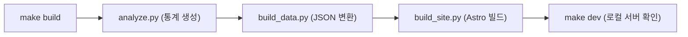
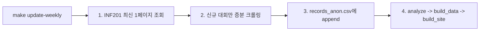
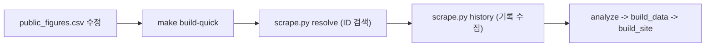
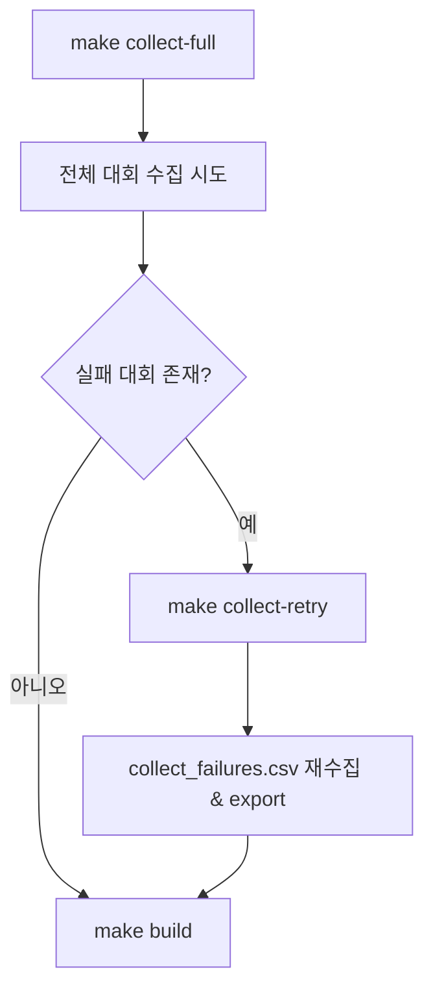
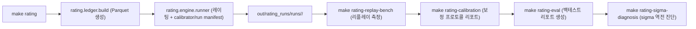
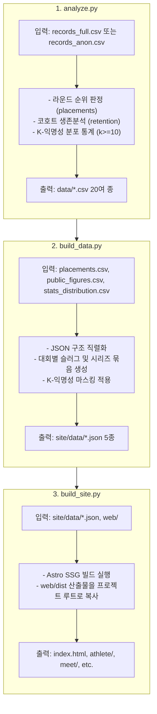

# splits 파이프라인 운영 런북 및 워크플로우 (Pipeline Runbook)

> **문서 버전**: 1.0  
> **최종 갱신일**: 2026-08-29  
> **관련 도구**: `Makefile`, `collect_full_history.py`, `analyze.py`, `build_data.py`, `build_site.py`, `rating/`

---

## 📌 목차

1. [개요 및 빠른 시작 (Quick Start)](#1-개요-및-빠른-시작-quick-start)
2. [사전 필수 환경 설정](#2-사전-필수-환경-설정)
3. [시나리오별 6대 핵심 워크플로우](#3-시나리오별-6대-핵심-워크플로우)
   - [Workflow 1. 일상적인 사이트 빌드 & 로컬 개발](#workflow-1-일상적인-사이트-빌드--로컬-개발)
   - [Workflow 2. 주간 신규 대회 증분 업데이트](#workflow-2-주간-신규-대회-증분-업데이트)
   - [Workflow 3. 공인 선수 신규 추가/수정 후 빌드](#workflow-3-공인-선수-신규-추가수정-후-빌드)
   - [Workflow 4. 분기 전수 재수집 및 실패 복구](#workflow-4-분기-전수-재수집-및-실패-복구)
   - [Workflow 5. Glicko-2 레이팅 산출 및 백테스트](#workflow-5-glicko-2-레이팅-산출-및-백테스트)
   - [Workflow 6. 배포 전 데이터 감사 및 무결성 검증](#workflow-6-배포-전-데이터-감사-및-무결성-검증)
4. [스크립트별 핵심 동작 메커니즘](#4-스크립트별-핵심-동작-메커니즘)
5. [트러블슈팅 및 장애 대응 (FAQ)](#5-트러블슈팅-및-장애-대응-faq)

---

## 1. 개요 및 빠른 시작 (Quick Start)

본 프로젝트는 긴 CLI 명령어와 복잡한 옵션을 외울 필요 없이, 루트 디렉토리의 **`Makefile`**을 통해 단 한 줄로 모든 파이프라인을 구동할 수 있습니다.

```bash
# 사용 가능한 전체 명령어 확인
make help
```

```text
======================================================================
  splits 프로젝트 파이프라인 단축 명령어 (Makefile)
======================================================================
  audit                🔍 [품질 감사] 커밋 정책 준수 검사 & ID 병합 신뢰도 감사
  build                🚀 [기본 빌드] 통계 분석 -> site JSON 생성 -> 정적 사이트 빌드
  build-quick          ⚡ [공인선수 빠른 빌드] scrape resolve/history -> analyze -> build
  clean                🧹 빌드 산출물 및 임시 파일 정리
  collect-full         🌐 [분기 전수 수집] 전체 대회 및 선수 전수 크롤링 실행
  collect-retry        🔁 [수집 실패 복구] 실패/부분완료 대회 재시도 및 export
  dev                  🌐 Astro 로컬 개발 서버 실행 (웹 UI 실시간 확인)
  rating               🏆 [레이팅 계산] 경기 레저 Parquet 생성 -> Glicko-2 레이팅 계산
  rating-calibration   🧭 [보정 프로토콜] 적합 폴드·재적합 주기·세그먼트 분리 판정 리포트 생성
  rating-eval          📊 [레이팅 백테스트] 정책별 비교 및 예측력 백테스트 리포트 생성
  rating-sigma-diagnosis 🔬 [sigma 진단] 실력 차이를 통제해 sigma-오차 역전이 교락인지 버그인지 판정
  setup                🛠️ 파이썬 패키지 및 Astro 웹 의존성 설치
  test                 🧪 [단위 테스트] pytest 전체 실행
  update-weekly        🔄 [주간 증분] 신규 대회 수집 -> records_anon 갱신 -> 통계 -> 사이트 빌드
======================================================================
```

---

## 2. 사전 필수 환경 설정

### 1) 패키지 의존성 설치

```bash
make setup
```

- Python 의존성(`requirements.txt`) 및 Astro 프론트엔드 패키지(`web/package.json`)를 한 번에 설치합니다.

### 2) 로컬 환경변수 설정 (`.env.local`)

익명화 키 일관성을 유지하기 위해 `.env.local` 파일에 SALT를 설정합니다. (Git 커밋 절대 금지)

```bash
cat > .env.local <<'EOF'
SPLITS_ANON_SALT=당신만의_충분히_긴_랜덤_시크릿_문자열
SPLITS_MEET_INDEX_CSV=/Users/kihyun/orgs/personal/splits/data/meet_index_inf201.csv
EOF
```

---

## 3. 시나리오별 6대 핵심 워크플로우

---

### Workflow 1. 일상적인 사이트 빌드 & 로컬 개발

> **상황**: 기존 데이터로 통계를 재집계하고 사이트를 빌드하여 웹 화면을 확인하고 싶을 때



```bash
# 1. 통계 재계산 및 정적 사이트 빌드
make build

# 2. 로컬 개발 서버 실행 (http://localhost:4321)
make dev
```

---

### Workflow 2. 주간 신규 대회 증분 업데이트

> **상황**: 주말 대회가 끝난 후 체육회에 새로 올라온 최신 경기 결과를 추가하고 배포할 때



```bash
# 신규 대회 탐색 -> 익명 원천 누적 -> 통계 재집계 -> 사이트 빌드까지 원클릭
make update-weekly
```

- 내부적으로 `data/meet_index_inf201.csv`를 기준으로 이미 수집된 대회를 건너뛰고, 신규 대회만 수집합니다.
- GitHub Actions 주간 자동화(`.github/workflows/data-weekly-refresh.yml`)에서도 동일한 로직이 실행됩니다.

---

### Workflow 3. 공인 선수 신규 추가/수정 후 빌드

> **상황**: `data/public_figures.csv`에 새로운 국가대표 선수를 추가했거나 프로필을 갱신했을 때



```bash
# 1. data/public_figures.csv 파일에 선수 정보 추가 (이름, 슬러그, 지정근거 등)
# 2. 빠른 수집 및 빌드 실행
make build-quick
```

---

### Workflow 4. 분기 전수 재수집 및 실패 복구

> **상황**: 분기별 전체 데이터 전수 검증이 필요하거나, 네트워크 오류로 일부 대회가 누락되었을 때



```bash
# 1. 전수 수집 실행 (중단 시 이어받기 지원)
make collect-full

# 2. 만약 실패/부분완료 대회가 있다면 재시도 및 full CSV 재생성
make collect-retry

# 3. 통계 및 사이트 빌드
make build
```

- 상세 런북: [reference/data/quarterly-full-recollection-runbook.md](file:///Users/kihyun/orgs/personal/splits/reference/data/quarterly-full-recollection-runbook.md)

---

### Workflow 5. 선수 기량 레이팅 산출 및 백테스트 (TrueSkill & Glicko-2)

> **상황**: 선수들의 실력 레이팅(Rating)을 갱신하거나 예측력 모델을 평가할 때



```bash
# 1. 레이팅 레저 빌드 및 TrueSkill 계산 (기본값)
make rating

# 2. 시즌 체크포인트를 이용한 리플레이 성능 측정
make rating-replay-bench

# 3. 보정기 적합 폴드/주기/세그먼트 분리 판정 리포트 생성
make rating-calibration

# 4. 최근 2개 시즌 홀드아웃 백테스트 리포트 생성 (12개 설정 비교)
make rating-eval

# 5. (선택) sigma-오차 역전이 교락인지 버그인지 판정
make rating-sigma-diagnosis
```

- 레이팅 실행 산출물: `out/rating_runs/runs/<run_id>/ratings.parquet`, `calibrator.json`, `rating_run.json`, `baseline_report.md`입니다. 레지스트리에는 예측·백테스트용 필터 스냅샷과 회고 분석용 스무딩 스냅샷을 분리해 저장합니다. 완료된 실행만 `out/rating_runs/runs/current`로 공개되며, `make rating-runs`로 완료 실행을 조회합니다. `make rating`은 `data/records_anon.csv`를 우선 사용하고, 파일이 없을 때만 `data/records_full.csv`를 사용합니다.
- 국가대표의 회고 차이는 `make rating-smoothing-report`로 생성합니다. 이 보고서의 스무딩 값은 미래 기록을 포함하므로 예측과 백테스트에 사용하지 않습니다.
- 국가대표 유년기 궤적 검증은 `make rating-trajectory`로 생성합니다. 궤적은 스무딩 추정치로, 예측력(AUC)과 양방향 확률은 필터 추정치로 계산하며, 선수 식별에 `SPLITS_ANON_SALT`와 `data/public_figures.csv`가 필요합니다. 판정 기준은 [ADR 0017](adr/0017-trajectory-findings.md)에 있습니다.
- 평가 산출물: `out/calibration_report.md`, `out/backtest_report.md`, `out/backtest_calibration/*.svg`입니다.
- 리플레이 측정: `out/replay_bench.md`; 원시 상태 체크포인트는 `out/replay_checkpoints/`에 생성되며 Git에 포함하지 않습니다.
- 최적 설정(ADR 0006): `conservative / meet / trueskill` (정확도 71.33%, Log-Loss 0.55523)
- 진단 산출물: `out/sigma_diagnosis_report.md`, `out/sigma_diagnosis/n_games_vs_sigma.svg`

> 백테스트 세그먼트 표에서 sigma가 큰 구간이 더 정확해 보이면 실력 차이 교락을 먼저 의심하세요.
> `make rating-sigma-diagnosis`가 `|mu 차이|`를 통제한 뒤 다시 재어 줍니다. 판정 배경은
> [ADR 0007](adr/0007-sigma-inversion.md)에 있습니다.

---

### Workflow 6. 배포 전 데이터 감사 및 무결성 검증

> **상황**: Git 커밋 또는 배포 전 개인정보 누출 여부와 데이터 정합성을 점검할 때

```bash
# 1. 커밋 정책 감사 (개인 식별 데이터가 staging에 들어갔는지 검사) + ID 병합 신뢰도 검사
make audit

# 2. 단위 테스트 전체 실행
make test
```

---

## 4. 스크립트별 핵심 동작 메커니즘



---

## 5. 트러블슈팅 및 장애 대응 (FAQ)

### Q1. `FileNotFoundError: data/records_full.csv` 또는 `records.csv` 에러 발생 시

- **원인**: `analyze.py`나 `build_data.py` 실행 시 원천 파일이 로컬에 없는 경우.
- **해결책**:
  - 공개된 `data/records_anon.csv`가 존재하면 `analyze.py`는 대부분의 통계를 재생성할 수 있습니다.
  - 공인 선수 기반 빌드라면 `make build-quick`을 먼저 실행하여 `records.csv`를 내려받으세요.

### Q2. 익명키(해시)가 갑자기 바뀌어 통계가 어긋나는 경우

- **원인**: 환경변수 `SPLITS_ANON_SALT`가 지정되지 않았거나 변경된 경우.
- **해결책**: `.env.local` 파일에 기존에 사용하던 SALT 값이 올바르게 입력되어 있는지 확인하세요.

### Q3. Astro 빌드 실패 (`npm run build error`)

- **원인**: `node_modules` 누락 또는 `site/data/*.json` 스키마 불일치.
- **해결책**:
  ```bash
  npm install --prefix web
  python build_data.py
  python build_site.py
  ```

### Q4. 주간 수집 중 알 수 없는 실패(`unknown failures`)가 발생할 때

- **원인**: 대한체육회 사이트 구조 변경 또는 일시적 네트워크 타임아웃.
- **해결책**:
  ```bash
  # 1. 실패 대회만 재시도
  make collect-retry
  # 2. data/collect_failures.csv 및 data/detail_failures.csv 로그 확인
  ```
