# R-05 Backtest Report

- generated_at: 2026-08-29T19:00:13
- holdout_seasons: 2025, 2026
- configs: 12

## 모델 설정 요약

| policy | period | engine | n | log_loss | accuracy | brier | ece | B3 대비 개선율 | 70% 과신 |
| --- | --- | --- | ---: | ---: | ---: | ---: | ---: | ---: | --- |
| conservative | meet | trueskill | 18,425 | 0.55523 | 0.7133 | 0.18822 | 0.01788 | 11.01% | N |
| conservative | month | trueskill | 18,425 | 0.55924 | 0.7084 | 0.19001 | 0.01763 | 10.37% | N |
| aggressive | meet | trueskill | 18,425 | 0.56118 | 0.7050 | 0.19072 | 0.01197 | 10.05% | N |
| aggressive | month | trueskill | 18,425 | 0.57063 | 0.6962 | 0.19475 | 0.01545 | 8.54% | N |
| conservative | meet | glicko2 | 18,425 | 0.57896 | 0.6912 | 0.19793 | 0.01122 | 7.20% | N |
| aggressive | meet | glicko2 | 18,425 | 0.58005 | 0.6892 | 0.19841 | 0.01199 | 7.03% | N |
| conservative | month | glicko2 | 18,425 | 0.58127 | 0.6894 | 0.19895 | 0.01306 | 6.83% | N |
| aggressive | month | glicko2 | 18,425 | 0.58246 | 0.6860 | 0.19945 | 0.01439 | 6.64% | N |
| place_only | meet | trueskill | 18,425 | 0.63696 | 0.6164 | 0.22379 | 0.02072 | -2.09% | N |
| place_only | meet | glicko2 | 18,425 | 0.64315 | 0.6199 | 0.22652 | 0.01438 | -3.08% | N |
| place_only | month | glicko2 | 18,425 | 0.64342 | 0.6179 | 0.22663 | 0.01570 | -3.13% | N |
| place_only | month | trueskill | 18,425 | 0.64418 | 0.6075 | 0.22706 | 0.02053 | -3.25% | N |

## 로그손실 95% 신뢰구간 (레이스 단위 블록 부트스트랩)

같은 레이스의 비교들은 독립이 아니므로 레이스를 통째로 리샘플링합니다.
구간이 겹치면 두 설정의 차이를 노이즈와 구분할 수 없습니다.

| policy | period | engine | log_loss | CI 하한 | CI 상한 | 최적 설정과 겹침 |
| --- | --- | --- | ---: | ---: | ---: | --- |
| conservative | meet | trueskill | 0.55523 | 0.54549 | 0.56427 | (최적) |
| conservative | month | trueskill | 0.55924 | 0.54984 | 0.56807 | Y |
| aggressive | meet | trueskill | 0.56118 | 0.55142 | 0.57036 | Y |
| aggressive | month | trueskill | 0.57063 | 0.56175 | 0.57884 | Y |
| conservative | meet | glicko2 | 0.57896 | 0.57005 | 0.58771 | N |
| aggressive | meet | glicko2 | 0.58005 | 0.57106 | 0.58843 | N |
| conservative | month | glicko2 | 0.58127 | 0.57273 | 0.58987 | N |
| aggressive | month | glicko2 | 0.58246 | 0.57359 | 0.59099 | N |
| place_only | meet | trueskill | 0.63696 | 0.63085 | 0.64348 | N |
| place_only | meet | glicko2 | 0.64315 | 0.63721 | 0.64939 | N |
| place_only | month | glicko2 | 0.64342 | 0.63781 | 0.64950 | N |
| place_only | month | trueskill | 0.64418 | 0.63846 | 0.65056 | N |

## 12설정 × 4베이스라인 로그손실

| policy | period | engine | B0 | B1 | B2 | B3 |
| --- | --- | --- | ---: | ---: | ---: | ---: |
| aggressive | meet | glicko2 | 0.69315 | 0.63529 | 0.64839 | 0.62391 |
| aggressive | meet | trueskill | 0.69315 | 0.63529 | 0.64839 | 0.62391 |
| aggressive | month | glicko2 | 0.69315 | 0.63529 | 0.64839 | 0.62391 |
| aggressive | month | trueskill | 0.69315 | 0.63529 | 0.64839 | 0.62391 |
| conservative | meet | glicko2 | 0.69315 | 0.63529 | 0.64839 | 0.62391 |
| conservative | meet | trueskill | 0.69315 | 0.63529 | 0.64839 | 0.62391 |
| conservative | month | glicko2 | 0.69315 | 0.63529 | 0.64839 | 0.62391 |
| conservative | month | trueskill | 0.69315 | 0.63529 | 0.64839 | 0.62391 |
| place_only | meet | glicko2 | 0.69315 | 0.63529 | 0.64839 | 0.62391 |
| place_only | meet | trueskill | 0.69315 | 0.63529 | 0.64839 | 0.62391 |
| place_only | month | glicko2 | 0.69315 | 0.63529 | 0.64839 | 0.62391 |
| place_only | month | trueskill | 0.69315 | 0.63529 | 0.64839 | 0.62391 |

베이스라인 로지스틱 스케일은 홀드아웃 이전 구간에서 log loss 최소화로 적합했습니다.

| policy | period | B2 scale | B2 적합표본 | B3 scale | B3 적합표본 |
| --- | --- | ---: | ---: | ---: | ---: |
| aggressive | meet | 0.07115 | 10,053 | 0.63719 | 121,190 |
| aggressive | month | 0.07115 | 10,053 | 0.63719 | 121,190 |
| conservative | meet | 0.07115 | 10,053 | 0.63719 | 121,190 |
| conservative | month | 0.07115 | 10,053 | 0.63719 | 121,190 |
| place_only | meet | 0.07115 | 10,053 | 0.63719 | 121,190 |
| place_only | month | 0.07115 | 10,053 | 0.63719 | 121,190 |

## 공통 부분집합 비교 (B1/B2 both-covered)

| policy | period | engine | subset_n | model | B0 | B1 | B2 | B3 |
| --- | --- | --- | ---: | ---: | ---: | ---: | ---: | ---: |
| aggressive | meet | glicko2 | 10,552 | 0.56562 | 0.69315 | 0.62368 | 0.63666 | 0.62740 |
| aggressive | meet | trueskill | 10,552 | 0.55156 | 0.69315 | 0.62368 | 0.63666 | 0.62740 |
| aggressive | month | glicko2 | 10,552 | 0.56863 | 0.69315 | 0.62368 | 0.63666 | 0.62740 |
| aggressive | month | trueskill | 10,552 | 0.55341 | 0.69315 | 0.62368 | 0.63666 | 0.62740 |
| conservative | meet | glicko2 | 10,552 | 0.56303 | 0.69315 | 0.62368 | 0.63666 | 0.62740 |
| conservative | meet | trueskill | 10,552 | 0.54451 | 0.69315 | 0.62368 | 0.63666 | 0.62740 |
| conservative | month | glicko2 | 10,552 | 0.56568 | 0.69315 | 0.62368 | 0.63666 | 0.62740 |
| conservative | month | trueskill | 10,552 | 0.54806 | 0.69315 | 0.62368 | 0.63666 | 0.62740 |
| place_only | meet | glicko2 | 10,552 | 0.62131 | 0.69315 | 0.62368 | 0.63666 | 0.62740 |
| place_only | meet | trueskill | 10,552 | 0.60696 | 0.69315 | 0.62368 | 0.63666 | 0.62740 |
| place_only | month | glicko2 | 10,552 | 0.62268 | 0.69315 | 0.62368 | 0.63666 | 0.62740 |
| place_only | month | trueskill | 10,552 | 0.61391 | 0.69315 | 0.62368 | 0.63666 | 0.62740 |

## 사후 보정 (Platt scaling)

캘리브레이션은 사후 보정으로 고칠 수 있지만 판별력은 어떤 후처리로도 못 늘립니다.
보정 전 비교는 고칠 수 있는 약점과 못 고치는 약점을 같은 무게로 재게 되므로,
두 엔진에 동일한 보정을 적용한 뒤 비교합니다. 보정기는 홀드아웃 직전 시즌에서 적합했습니다.
단조 변환이라 정확도는 보정 전후가 같습니다.

| policy | period | engine | slope | intercept | log_loss 보정전 | 보정후 | ECE 보정전 | 보정후 |
| --- | --- | --- | ---: | ---: | ---: | ---: | ---: | ---: |
| conservative | meet | trueskill | 0.5515 | +0.0191 | 0.58877 | 0.55523 | 0.07204 | 0.01788 |
| conservative | month | trueskill | 0.5260 | +0.0199 | 0.59542 | 0.55924 | 0.07545 | 0.01763 |
| aggressive | meet | trueskill | 0.6166 | +0.0225 | 0.58274 | 0.56118 | 0.06185 | 0.01197 |
| aggressive | month | trueskill | 0.6042 | +0.0229 | 0.58674 | 0.57063 | 0.05789 | 0.01545 |
| conservative | meet | glicko2 | 0.7636 | +0.0222 | 0.58325 | 0.57896 | 0.03384 | 0.01122 |
| aggressive | meet | glicko2 | 0.8260 | +0.0225 | 0.58138 | 0.58005 | 0.02186 | 0.01199 |
| conservative | month | glicko2 | 0.7417 | +0.0220 | 0.58524 | 0.58127 | 0.03368 | 0.01306 |
| aggressive | month | glicko2 | 0.7985 | +0.0226 | 0.58344 | 0.58246 | 0.02135 | 0.01439 |
| place_only | meet | trueskill | 0.5600 | +0.0267 | 0.65682 | 0.63696 | 0.07899 | 0.02072 |
| place_only | meet | glicko2 | 0.7272 | +0.0310 | 0.64702 | 0.64315 | 0.03603 | 0.01438 |
| place_only | month | glicko2 | 0.7092 | +0.0312 | 0.64702 | 0.64342 | 0.03518 | 0.01570 |
| place_only | month | trueskill | 0.5585 | +0.0270 | 0.66163 | 0.64418 | 0.07483 | 0.02053 |

## ECE 유한표본 귀무분포

ECE는 유한표본에서 위로 편향됩니다. 완전히 캘리브레이션된 예측기도 0이 나오지 않으므로,
관측 ECE가 노이즈 바닥 위인지 확인해야 게이트를 해석할 수 있습니다.
예측 확률은 그대로 두고 라벨만 그 확률에서 뽑아 귀무분포를 만들었습니다.

| policy | period | engine | 관측 ECE | 귀무 p50 | 귀무 p95 | 귀무 p99 | 노이즈 초과 |
| --- | --- | --- | ---: | ---: | ---: | ---: | --- |
| conservative | meet | trueskill | 0.01788 | 0.00734 | 0.01086 | 0.01289 | Y |
| conservative | month | trueskill | 0.01763 | 0.00753 | 0.01074 | 0.01249 | Y |
| aggressive | meet | trueskill | 0.01197 | 0.00746 | 0.01108 | 0.01267 | Y |
| aggressive | month | trueskill | 0.01545 | 0.00754 | 0.01158 | 0.01268 | Y |
| conservative | meet | glicko2 | 0.01122 | 0.00759 | 0.01140 | 0.01364 | N |
| aggressive | meet | glicko2 | 0.01199 | 0.00766 | 0.01158 | 0.01268 | Y |
| conservative | month | glicko2 | 0.01306 | 0.00768 | 0.01130 | 0.01377 | Y |
| aggressive | month | glicko2 | 0.01439 | 0.00764 | 0.01143 | 0.01354 | Y |
| place_only | meet | trueskill | 0.02072 | 0.00715 | 0.01096 | 0.01226 | Y |
| place_only | meet | glicko2 | 0.01438 | 0.00709 | 0.01125 | 0.01317 | Y |
| place_only | month | glicko2 | 0.01570 | 0.00711 | 0.01081 | 0.01258 | Y |
| place_only | month | trueskill | 0.02053 | 0.00703 | 0.01091 | 0.01323 | Y |

## 예측 확률 분포와 불확실성

확률이 극단으로 몰리면(판별력은 있는데 스케일이 깨진 상태) 여기서 먼저 드러납니다.
tau는 홀드아웃 이전 구간에서 log loss로 골랐습니다.

| policy | period | engine | tau | p 표준편차 | p<0.1 또는 >0.9 | 불확실성 p50 | 불확실성 p10 |
| --- | --- | --- | ---: | ---: | ---: | ---: | ---: |
| conservative | meet | trueskill | 1.0000 | 0.2391 | 9.8% | 2.489 | 2.344 |
| conservative | month | trueskill | 1.0000 | 0.2325 | 8.8% | 2.490 | 2.343 |
| aggressive | meet | trueskill | 1.0000 | 0.2368 | 8.9% | 2.419 | 2.289 |
| aggressive | month | trueskill | 0.5000 | 0.2205 | 6.2% | 1.710 | 1.627 |
| conservative | meet | glicko2 | 0.2000 | 0.2207 | 4.8% | 68.708 | 43.075 |
| aggressive | meet | glicko2 | 0.2000 | 0.2191 | 4.5% | 65.403 | 41.823 |
| conservative | month | glicko2 | 1.2000 | 0.2145 | 3.7% | 69.123 | 41.983 |
| aggressive | month | glicko2 | 0.2000 | 0.2122 | 3.5% | 65.596 | 40.667 |
| place_only | meet | trueskill | 1.0000 | 0.1580 | 1.3% | 2.475 | 2.237 |
| place_only | meet | glicko2 | 0.2000 | 0.1494 | 0.5% | 137.137 | 62.768 |
| place_only | month | glicko2 | 0.2000 | 0.1457 | 0.3% | 138.308 | 61.679 |
| place_only | month | trueskill | 0.5000 | 0.1469 | 0.8% | 2.084 | 1.605 |

## 캘리브레이션 플롯

- `aggressive/meet/glicko2`: 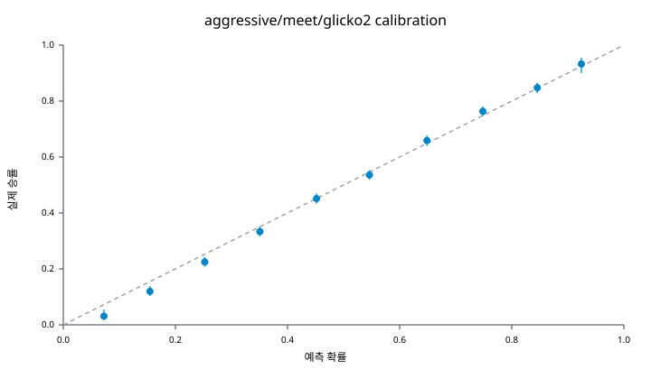
- `aggressive/meet/trueskill`: 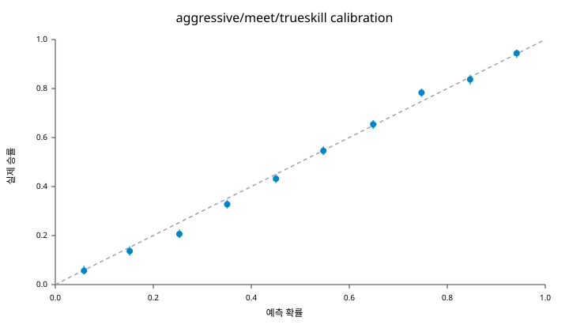
- `aggressive/month/glicko2`: 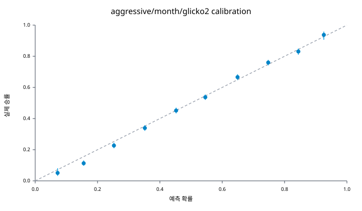
- `aggressive/month/trueskill`: 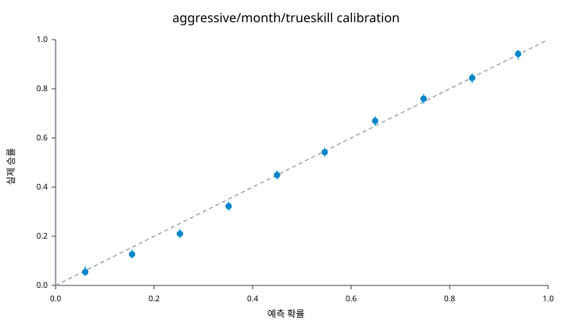
- `conservative/meet/glicko2`: 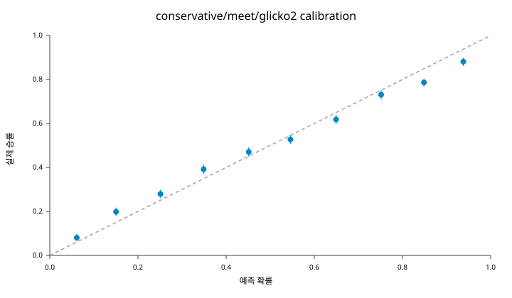
- `conservative/meet/trueskill`: 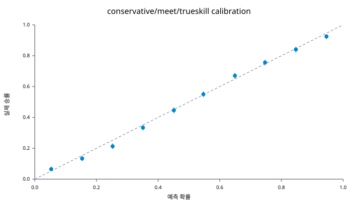
- `conservative/month/glicko2`: 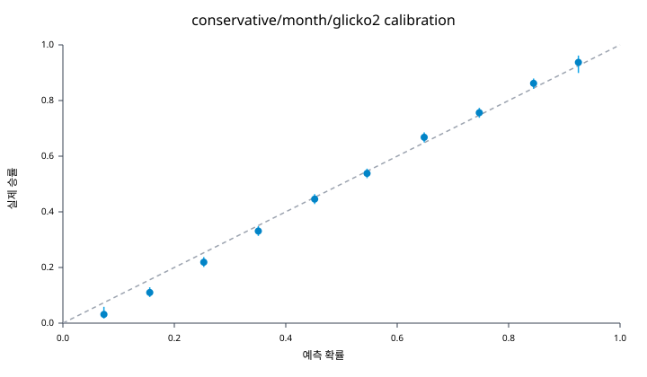
- `conservative/month/trueskill`: 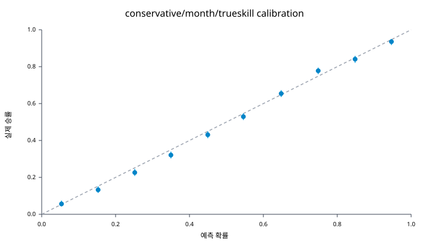
- `place_only/meet/glicko2`: 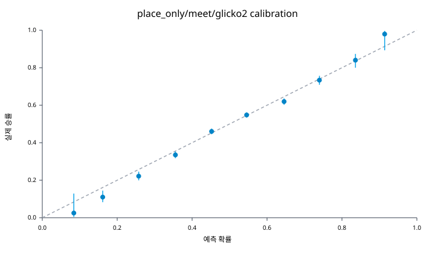
- `place_only/meet/trueskill`: 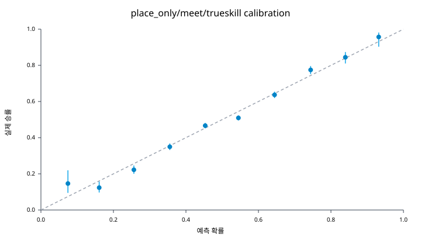
- `place_only/month/glicko2`: 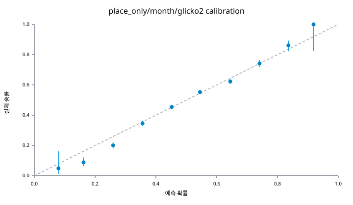
- `place_only/month/trueskill`: 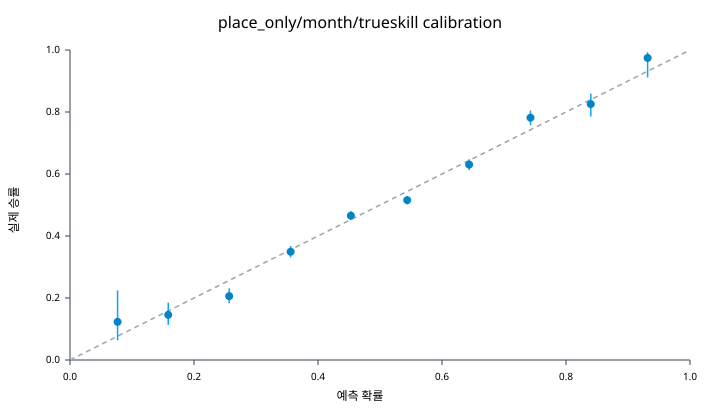

## 세그먼트 분해 (best config)

### n_games

| bucket | n | log_loss | accuracy | brier |
| --- | ---: | ---: | ---: | ---: |
| 21+ | 12,457 | 0.56363 | 0.7145 | 0.19047 |
| 6-20 | 3,776 | 0.46193 | 0.7847 | 0.15095 |
| 0-5 | 2,192 | 0.66824 | 0.5835 | 0.23961 |

### phi

| bucket | n | log_loss | accuracy | brier |
| --- | ---: | ---: | ---: | ---: |
| high(> 2.6) | 6,257 | 0.50248 | 0.7473 | 0.16751 |
| mid(2.4~2.6) | 6,086 | 0.55592 | 0.7212 | 0.18737 |
| low(<= 2.4) | 6,082 | 0.60883 | 0.6703 | 0.21038 |

### round

| bucket | n | log_loss | accuracy | brier |
| --- | ---: | ---: | ---: | ---: |
| semifinal | 5,754 | 0.55326 | 0.7158 | 0.18712 |
| quarterfinal | 5,410 | 0.52633 | 0.7351 | 0.17669 |
| final | 3,449 | 0.61629 | 0.6770 | 0.21226 |
| heat | 2,900 | 0.51263 | 0.7369 | 0.17189 |
| final_b | 912 | 0.64368 | 0.6294 | 0.22453 |

### grade

| bucket | n | log_loss | accuracy | brier |
| --- | ---: | ---: | ---: | ---: |
| 3 | 4,100 | 0.51217 | 0.7512 | 0.17027 |
| 6 | 3,587 | 0.51191 | 0.7441 | 0.17106 |
| 2 | 3,326 | 0.59263 | 0.6915 | 0.20226 |
| 4 | 2,387 | 0.57675 | 0.6891 | 0.19859 |
| (unknown-grade) | 2,214 | 0.56822 | 0.6978 | 0.19381 |
| 1 | 1,607 | 0.59473 | 0.6839 | 0.20398 |
| 5 | 1,204 | 0.60839 | 0.6678 | 0.20981 |

### event

| bucket | n | log_loss | accuracy | brier |
| --- | ---: | ---: | ---: | ---: |
| 1500M | 7,016 | 0.55548 | 0.7111 | 0.18867 |
| 500M | 5,162 | 0.54766 | 0.7181 | 0.18503 |
| 1000M | 4,656 | 0.56378 | 0.7040 | 0.19158 |
| 3000M | 921 | 0.54814 | 0.7405 | 0.18354 |
| 2000M | 645 | 0.55652 | 0.7287 | 0.18908 |
| 1000M S.F | 25 | 0.68727 | 0.6400 | 0.24439 |

### source_status

| bucket | n | log_loss | accuracy | brier |
| --- | ---: | ---: | ---: | ---: |
| FIN-FIN | 18,425 | 0.55523 | 0.7133 | 0.18822 |

## GO/STOP 판정

- best_config: `conservative/meet/trueskill`
- best_log_loss: **0.55523**
- B3_log_loss: **0.62391**
- improvement_vs_B3: **11.01%**
- holdout 비율: **18,425 / 165,399** (11.1%)
- verdict: **GO**

| 조건 | 관측값 | 통과 |
| --- | ---: | --- |
| 개선율 >= 5% | 11.01% | Y |
| ECE <= 0.03 | 0.01788 | Y |
| 70% 과신 없음 | N | Y |
