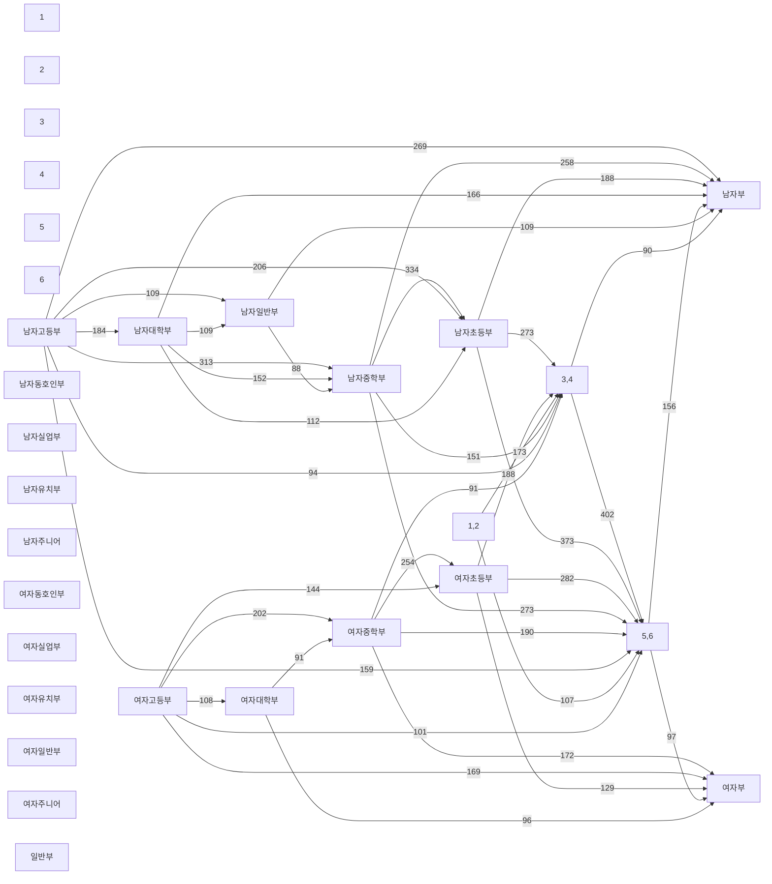

# R-01 연결성 분석 리포트

- 생성시각: 2026-08-29T11:53:29
- 입력 파일: `data/records_anon.csv`
- 판정: **GO**
- 판정 근거: 남/여 각 성별 내부 거대 성분 비율이 90% 이상이고, 핵심 단계 전이(초등→중등→고등→대학·일반)의 공유 선수 최소값이 10명 이상입니다.

## 입력/전처리 진단

- race_id 소스: `reconstructed`
- 전체 입력 행수: **128,912**
- 필터 후 사용 행수: **92,072**
- 필터 후 선수수: **2,285**
- 필터 후 race 수: **20,844**
- race_id 복원 후 결측 행수: **0**

| 제외 사유 | 행수 |
| --- | --- |
| 선수 식별자 결측 | 0 |
| race_id 결측 | 0 |
| 쇼트트랙 외 행 | 11,375 |
| 채점종합 행 | 11,960 |
| 릴레이/계주 행 | 1,266 |
| 비완주 행 | 11,904 |
| 중복 athlete-race 행 | 335 |

## 1) 전체 그래프

- 노드(선수) 수: **2,285**
- 엣지(대결 관계) 수: **46,475**
- 연결 성분 수: **25**
- 거대 성분 비율: **53.70%**
- 차수 평균: **40.68**
- 차수 p50: **24.00**
- 차수 p10: **4.00**

### 성별 내부 연결성

| 성별 | 노드수 | 성분수 | 거대성분비율 | 90% 하락 여유(명) | 상위2개 성분 크기 |
| --- | --- | --- | --- | --- | --- |
| 남 | 1,359 | 20 | 90.29% | 4 | 1227, 70 |
| 여 | 915 | 10 | 94.75% | 44 | 867, 12 |

- 성별 미상/기타 노드 수: **11**
| 성별 라벨 | 노드수 |
| --- | --- |
| (빈값) | 11 |
- 최저 여유 성별: **남** (1,227/1,359, 90% 하락 여유 4명)

## 2) 시즌 단절 검사

- 2개 이상 시즌 등장 선수 수: **1,521**
- 2개 이상 시즌 등장 선수 비율: **66.56%**

| 시즌 | 노드수 | 엣지수 | 성분수 | 거대성분비율 |
| --- | --- | --- | --- | --- |
| 2007 | 287 | 1,284 | 14 | 21.25% |
| 2008 | 301 | 1,428 | 11 | 21.93% |
| 2009 | 305 | 1,335 | 13 | 23.61% |
| 2010 | 307 | 1,404 | 12 | 17.92% |
| 2011 | 326 | 1,624 | 13 | 19.02% |
| 2012 | 590 | 3,740 | 24 | 41.53% |
| 2013 | 494 | 3,901 | 11 | 53.85% |
| 2014 | 516 | 4,548 | 4 | 54.26% |
| 2015 | 513 | 5,231 | 7 | 58.28% |
| 2016 | 530 | 6,211 | 10 | 61.13% |
| 2017 | 562 | 6,363 | 8 | 56.23% |
| 2018 | 567 | 6,665 | 3 | 58.20% |
| 2019 | 571 | 6,480 | 13 | 53.24% |
| 2020 | 523 | 3,549 | 10 | 56.60% |
| 2021 | 463 | 5,339 | 8 | 40.60% |
| 2022 | 462 | 6,152 | 3 | 56.71% |
| 2023 | 472 | 6,172 | 4 | 55.08% |
| 2024 | 494 | 6,629 | 3 | 55.87% |
| 2025 | 497 | 7,040 | 4 | 54.33% |
| 2026 | 430 | 4,352 | 4 | 55.35% |

## 3) 학령 단절 검사

- (시즌,부문라벨,성별) 셀 수: **339**
- 셀 선수수 p50: **35.00**
- 셀 선수수 p10: **12.00**
- 동일 race 내 혼합 부문라벨 수(검증용): **0**
- 부문 메타그래프 노드 수: **30**
- 부문 메타그래프 엣지 수(공유선수 기반): **105**
- 부문 메타그래프 연결 성분 수: **3**
- 2개 이상 부문에 등장한 선수 수: **1,353**
- 2개 이상 부문에 등장한 선수 비율: **59.50%**

### 부문 메타 그래프(공유선수 기반)

### 셀 규모 상위 20개

| 시즌 | 부문라벨 | 성별 | 선수수 |
| --- | --- | --- | --- |
| 2018 | 남자부 | 남 | 117 |
| 2024 | 남자부 | 남 | 114 |
| 2025 | 남자부 | 남 | 109 |
| 2023 | 남자부 | 남 | 106 |
| 2016 | 남자부 | 남 | 104 |
| 2019 | 남자부 | 남 | 98 |
| 2016 | 남자중학부 | 남 | 92 |
| 2017 | 남자부 | 남 | 91 |
| 2022 | 남자부 | 남 | 89 |
| 2016 | 남자초등부 | 남 | 87 |
| 2017 | 남자중학부 | 남 | 87 |
| 2020 | 남자중학부 | 남 | 86 |
| 2021 | 남자부 | 남 | 85 |
| 2024 | 남자중학부 | 남 | 84 |
| 2018 | 남자중학부 | 남 | 84 |
| 2015 | 남자부 | 남 | 83 |
| 2015 | 남자중학부 | 남 | 83 |
| 2015 | 남자초등부 | 남 | 83 |
| 2023 | 남자중학부 | 남 | 81 |
| 2019 | 남자중학부 | 남 | 80 |

## 4) 종적 다리 강도

- 연속 시즌 등장 선수 수: **1,497**
- 연속 시즌 등장 선수 비율: **65.83%**
- 종적 비교 후보 선수 수(2+시즌): **1,520**
- 비교 가능한 셀 수(이전 시즌·동일 성별 풀 존재): **328**
- 양방향 비교 가능한 셀 수(이전+다음 시즌 동일 성별 풀 존재): **310**
- 고립 셀 수(이전·다음 시즌 모두 공유선수 0): **11**
- 셀-이전시즌 공유선수 최소값: **0**
- 셀-이전시즌 공유선수 p50: **27.00**
- 셀-이전시즌 공유선수 p10: **1.00**
- 셀-다음시즌 공유선수 최소값: **0**
- 셀-다음시즌 공유선수 p50: **28.00**
- 셀-다음시즌 공유선수 p10: **7.00**
- 부문 간 공유선수 엣지 수: **105**
- 부문 간 공유선수 최소값: **1**
- 부문 간 공유선수 p50: **40.00**
- 핵심 단계 전이 공유선수 최소값(남/여×초등→중등→고등→대학·일반): **176**
- 고립 셀 소속 선수 비율: **3.61%**

### 고립 셀(최대 30개)

| 시즌 | 부문라벨 | 성별 | 선수수 |
| --- | --- | --- | --- |
| 2012 | 3 | 남 | 22 |
| 2012 | 3 | 여 | 6 |
| 2012 | 4 | 남 | 13 |
| 2012 | 4 | 여 | 9 |
| 2012 | 5 | 여 | 2 |
| 2012 | 6 | 남 | 2 |
| 2012 | 남자유치부 | 남 | 15 |
| 2012 | 여자유치부 | 여 | 5 |
| 2015 | 남자동호인부 | 남 | 1 |
| 2019 | 남자주니어 | 남 | 3 |
| 2019 | 여자주니어 | 여 | 4 |

### 핵심 단계 전이 다리 두께

| 성별 | from | to | 공유선수수 |
| --- | --- | --- | --- |
| 남 | 초등 | 중등 | 331 |
| 남 | 중등 | 고등 | 295 |
| 남 | 고등 | 대학·일반 | 275 |
| 여 | 초등 | 중등 | 263 |
| 여 | 중등 | 고등 | 191 |
| 여 | 고등 | 대학·일반 | 176 |

### 최저 여유 성별의 2번째 성분 점검

- 성별: **남**
- 2번째 성분 크기: **70**

| 부문라벨 | 선수수 |
| --- | --- |
| 1,2 | 23 |
| 2 | 19 |
| 5 | 17 |
| 3 | 15 |
| 3,4 | 15 |
| 1 | 8 |
| 남자유치부 | 6 |
| 5,6 | 5 |
| 4 | 3 |

| 시즌 | 선수수 |
| --- | --- |
| 2012 | 70 |
| 2013 | 3 |

## 5) 관측치 규모

- 완주자 pairwise 총 개수: **173,856**
- race 수: **20,844**
- race 인원수 p50: **4.00**
- race 인원수 p10: **3.00**
- 선수당 pairwise p50: **37.00**
- 선수당 pairwise p10: **5.00**

## 판정 규칙(사전 고정)

| 조건 | 판정 |
| --- | --- |
| 각 성별 내부 거대 성분 ≥ 90% AND 핵심 단계 전이 공유 선수 최소값 ≥ 10 | GO |
| 성별 내부 거대 성분 70~90% | 조건부 GO |
| 성별 내부 거대 성분 < 70% | STOP |

## 판정 메모

- 최종 결론: **GO**
- 근거: 남/여 각 성별 내부 거대 성분 비율이 90% 이상이고, 핵심 단계 전이(초등→중등→고등→대학·일반)의 공유 선수 최소값이 10명 이상입니다.
- 핵심 단계 전이 공유 선수 최소값 관측: **176**
- 고립 셀 소속 선수 비율 관측값: **3.61%**
- 5% 기준 충족 여부: **Y**

