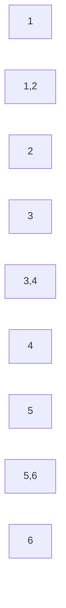

# R-01 연결성 분석 리포트

- 생성시각: 2026-08-29T11:32:14
- 입력 파일: `data/records_anon.csv`
- 판정: **STOP**
- 판정 근거: 거대 성분 비율이 70% 미만이라 레이팅 비교 그래프의 전역 연결성이 부족합니다.

## 입력/전처리 진단

- race_id 소스: `reconstructed`
- 전체 입력 행수: **128,912**
- 필터 후 사용 행수: **92,072**
- 필터 후 선수수: **2,285**
- 필터 후 race 수: **20,844**
- race_id 복원 후 결측 행수: **0**

| 제외 사유 | 행수 |
| --- | --- |
| 선수 식별자 결측 | 0 |
| race_id 결측 | 0 |
| 쇼트트랙 외 행 | 11,375 |
| 채점종합 행 | 11,960 |
| 릴레이/계주 행 | 1,266 |
| 비완주 행 | 11,904 |
| 중복 athlete-race 행 | 335 |

## 1) 전체 그래프

- 노드(선수) 수: **2,285**
- 엣지(대결 관계) 수: **46,475**
- 연결 성분 수: **25**
- 거대 성분 비율: **53.70%**
- 차수 평균: **40.68**
- 차수 p50: **24.00**
- 차수 p10: **4.00**

## 2) 시즌 단절 검사

- 2개 이상 시즌 등장 선수 수: **1,521**
- 2개 이상 시즌 등장 선수 비율: **66.56%**

| 시즌 | 노드수 | 엣지수 | 성분수 | 거대성분비율 |
| --- | --- | --- | --- | --- |
| 2007 | 287 | 1,284 | 14 | 21.25% |
| 2008 | 301 | 1,428 | 11 | 21.93% |
| 2009 | 305 | 1,335 | 13 | 23.61% |
| 2010 | 307 | 1,404 | 12 | 17.92% |
| 2011 | 326 | 1,624 | 13 | 19.02% |
| 2012 | 590 | 3,740 | 24 | 41.53% |
| 2013 | 494 | 3,901 | 11 | 53.85% |
| 2014 | 516 | 4,548 | 4 | 54.26% |
| 2015 | 513 | 5,231 | 7 | 58.28% |
| 2016 | 530 | 6,211 | 10 | 61.13% |
| 2017 | 562 | 6,363 | 8 | 56.23% |
| 2018 | 567 | 6,665 | 3 | 58.20% |
| 2019 | 571 | 6,480 | 13 | 53.24% |
| 2020 | 523 | 3,549 | 10 | 56.60% |
| 2021 | 463 | 5,339 | 8 | 40.60% |
| 2022 | 462 | 6,152 | 3 | 56.71% |
| 2023 | 472 | 6,172 | 4 | 55.08% |
| 2024 | 494 | 6,629 | 3 | 55.87% |
| 2025 | 497 | 7,040 | 4 | 54.33% |
| 2026 | 430 | 4,352 | 4 | 55.35% |

## 3) 학령 단절 검사

- (시즌,학년,성별) 셀 수: **102**
- 셀 선수수 p50: **27.00**
- 셀 선수수 p10: **8.00**
- 혼합학년 race 수: **0**
- 학년 메타그래프 노드 수: **9**
- 학년 메타그래프 엣지 수: **0**
- 학년 메타그래프 연결 성분 수: **9**

### 학년 메타 그래프

### 셀 규모 상위 20개

| 시즌 | 학년 | 성별 | 선수수 |
| --- | --- | --- | --- |
| 2019 | 5,6 | 남 | 65 |
| 2022 | 5,6 | 남 | 59 |
| 2024 | 5,6 | 남 | 58 |
| 2014 | 5,6 | 남 | 53 |
| 2019 | 5,6 | 여 | 53 |
| 2015 | 5,6 | 남 | 53 |
| 2018 | 5,6 | 남 | 53 |
| 2017 | 5,6 | 남 | 51 |
| 2022 | 5,6 | 여 | 50 |
| 2016 | 5,6 | 남 | 49 |
| 2012 | 3,4 | 남 | 48 |
| 2018 | 5,6 | 여 | 47 |
| 2022 | 3,4 | 남 | 46 |
| 2021 | 5,6 | 남 | 43 |
| 2017 | 3,4 | 남 | 43 |
| 2024 | 3,4 | 남 | 42 |
| 2018 | 3,4 | 남 | 42 |
| 2013 | 3,4 | 남 | 41 |
| 2012 | 5,6 | 남 | 41 |
| 2020 | 5,6 | 남 | 41 |

## 4) 종적 다리 강도

- 학년 상승(시즌+1, 학년+1) 지속 선수 수: **0**
- 학년 상승 지속 선수 비율: **0.00%**
- 비교 가능한 셀 수(이전 시즌·이전 학년 존재): **0**
- 고립 셀 수(공유선수 0): **0**
- 셀 간 공유선수 최소값: **0**
- 셀 간 공유선수 p50: **0.00**
- 셀 간 공유선수 p10: **0.00**
- 고립 셀 소속 선수 비율: **0.00%**

- 참고: 현재 입력에서 단일 학년값으로 이전 시즌-이전 학년 비교가 가능한 셀이 없어, 종적 다리 강도는 하한치로 해석해야 합니다.

## 5) 관측치 규모

- 완주자 pairwise 총 개수: **173,856**
- race 수: **20,844**
- race 인원수 p50: **4.00**
- race 인원수 p10: **3.00**
- 선수당 pairwise p50: **37.00**
- 선수당 pairwise p10: **5.00**

## 판정 규칙(사전 고정)

| 조건 | 판정 |
| --- | --- |
| 거대 성분 ≥ 90% AND 고립 (시즌,학년) 셀 없음 | GO |
| 거대 성분 70~90% | 조건부 GO |
| 거대 성분 < 70% | STOP |

## 판정 메모

- 최종 결론: **STOP**
- 근거: 거대 성분 비율이 70% 미만이라 레이팅 비교 그래프의 전역 연결성이 부족합니다.
- 운영 기준: 고립 셀 소속 선수 비율이 5% 미만이면 해당 셀만 레이팅 미제공으로 분리 운영하고, 5% 이상이면 설계를 재검토합니다.
- 고립 셀 소속 선수 비율 관측값: **0.00%**
- 5% 기준 충족 여부: **Y**

