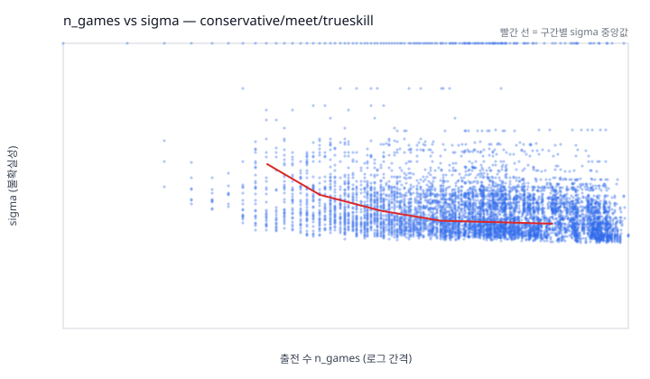

# R-19 — sigma 역전 원인 규명

- 대상 설정: `conservative/meet/trueskill`
- 홀드아웃 시즌: 2025, 2026
- 홀드아웃 비교 수: 18,425
- sigma 구간 경계(터사일): low <= 2.9647 < mid <= 3.5002 < high
- `|mu 차이|` 5분위 경계: 2.2578, 4.8202, 7.6368, 11.9056

sigma는 레이팅의 불확실성입니다. 값이 클수록 그 선수의 실력을 아직 덜 안다는 뜻이고,
쌍에서는 두 선수 중 큰 쪽을 씁니다. `|mu 차이|`는 두 선수 레이팅 평균의 절댓값 차이로,
값이 클수록 애초에 승부를 맞히기 쉬운 쌍입니다.

## 1. 통제 이전 (R-05 재현)

| sigma 구간 | n | log_loss | accuracy | brier |
| --- | ---: | ---: | ---: | ---: |
| low | 6,100 | 0.58437 | 0.6892 | 0.19984 |
| mid | 6,062 | 0.52813 | 0.7382 | 0.17701 |
| high | 6,263 | 0.55269 | 0.7097 | 0.18711 |

high − low log loss 차이: **-0.03168** (음수면 불확실성이 큰 쪽이 더 정확한 역전)

## 2. `|mu 차이|` 통제 후 sigma-오차 관계

각 행은 실력 차이가 비슷한 쌍끼리 묶은 구간입니다. 같은 행 안에서 low와 high를
비교하면 실력 차이 효과가 제거된 상태의 sigma 효과만 남습니다.

| `|mu 차이|` 분위 | 범위 | n | low sigma | mid sigma | high sigma | high − low | 역전 | 칸 안 실제 실력차(low / high) |
| --- | --- | ---: | ---: | ---: | ---: | ---: | --- | --- |
| Q1 | 0.000~2.258 | 3,686 | 0.68742 | 0.68775 | 0.68886 | +0.00144 | N | 1.06 / 1.00 |
| Q2 | 2.258~4.820 | 3,685 | 0.65805 | 0.64307 | 0.68120 | +0.02315 | N | 3.46 / 3.54 |
| Q3 | 4.820~7.637 | 3,686 | 0.57117 | 0.59132 | 0.62713 | +0.05597 | N | 6.15 / 6.23 |
| Q4 | 7.637~11.906 | 3,684 | 0.46050 | 0.45239 | 0.53963 | +0.07914 | N | 9.27 / 9.64 |
| Q5 | 11.906~42.912 | 3,684 | 0.31026 | 0.24604 | 0.41057 | +0.10031 | N | 14.09 / 16.49 |

마지막 열은 같은 분위 안에서 low/high 쌍이 실제로 마주한 실력 차이의 중앙값입니다.
두 값이 벌어져 있으면 그 칸은 아직 실력 차이가 덜 통제된 상태이므로, 거기서 나온
역전은 sigma 효과로 읽으면 안 됩니다.

표본이 200건 미만인 칸은 log loss가 노이즈에 휘둘리므로 수치를 숨기고
표본 수만 적었습니다. 값이 없는 것은 그 구간의 예측이 나쁘다는 뜻이 아니라,
판정에 쓸 만큼 사례가 모이지 않았다는 뜻입니다.

## 3. 판정

판정 규칙은 표를 보기 전에 고정했습니다.

| 규칙 | 값 |
| --- | --- |
| 역전으로 인정하는 최소 log loss 차이 | 0.01 |
| 신뢰할 수 있는 칸의 최소 표본 | 200 |
| 버그로 판정하는 최소 역전 분위 수 | 3 |

- 비교 가능한 분위: **5** / 5
- 역전이 남은 분위: **0**

최종 판정: **교락**

실력 차이를 통제하자 비교 가능한 5개 분위 중 0개에만 역전이 남았습니다. 역전의 대부분은 sigma가 큰 쌍이 실력 차이도 컸다는 사실로 설명됩니다.

### 통제 촘촘함에 따른 민감도

5분위는 한 칸이 넓어 칸 안에 실력 차이가 여전히 섞입니다. 구간을 더 잘게 나눌수록
역전이 줄어들면, 남은 역전은 실제 효과가 아니라 통제가 덜 된 흔적입니다.

| `|mu 차이|` 구간 수 | 비교 가능한 구간 | 역전이 남은 구간 |
| ---: | ---: | ---: |
| 5 | 5 | 0 |
| 10 | 9 | 0 |
| 20 | 15 | 1 |

## 4. 보조 확인 — `n_games`에 따른 sigma 단조 감소

| 출전 수 | n | sigma p10 | sigma p50 | sigma p90 |
| --- | ---: | ---: | ---: | ---: |
| 0 | 122 | 8.3333 | 8.3333 | 8.3333 |
| 1-2 | 58 | 5.4820 | 8.3333 | 8.3333 |
| 3-5 | 102 | 3.7439 | 8.3333 | 8.3333 |
| 6-10 | 367 | 3.0860 | 4.8129 | 8.3333 |
| 11-20 | 1,090 | 2.9602 | 3.9069 | 8.3333 |
| 21-40 | 2,398 | 2.8541 | 3.4395 | 8.3333 |
| 41-80 | 3,228 | 2.7723 | 3.1479 | 4.2546 |
| 81+ | 11,060 | 2.6853 | 3.0627 | 3.8789 |

출전 수와 sigma의 순위 상관: **-0.3593** (음수면 출전이 늘수록 불확실성이 줄어드는 정상 방향)

## 5. 보조 확인 — 휴지기에 따른 sigma 회복

마지막 출전 이후 오래 쉰 선수는 실력을 다시 모르게 되므로 sigma가 커져야 합니다.
커지지 않으면 오래 쉰 선수에게 과신한 확률을 매기게 됩니다.

| 휴지기 | n | sigma p10 | sigma p50 | sigma p90 |
| --- | ---: | ---: | ---: | ---: |
| 0 (같은 달) | 122 | 8.3333 | 8.3333 | 8.3333 |
| 1-3개월 | 12,929 | 2.6876 | 2.9956 | 3.8411 |
| 4-6개월 | 3,021 | 3.1738 | 3.5132 | 8.3333 |
| 7-12개월 | 2,210 | 3.6119 | 3.9076 | 5.1341 |
| 13-24개월 | 141 | 5.0196 | 5.3739 | 7.0021 |
| 25개월+ | 2 | 8.3333 | 8.3333 | 8.3333 |

휴지기와 sigma의 순위 상관: **+0.6178** (0에 가까우면 쉬어도 불확실성이 되돌아오지 않는다는 뜻)
